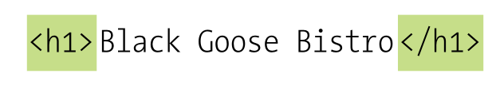

# Leksioni 1: Hyrje në Front End Developer. Bazat më HTML

## **Çfarë do të mësojmë në këtë leksion?**

Në këtë leksion, do të bëjmë një zhytje të thellë në botën e zhvillimit të web-it. Do të fillojmë nga themelet e internetit dhe do të zbulojmë se si funksionojnë faqet web që vizitojmë çdo ditë. 

**Në fund të këtij leksioni, ju do të jeni në gjendje të:**

* **Kuptoni** konceptin e internetit, web-it dhe ndryshimin midis tyre.
* **Shpjegoni** rolin e serverave, browser-ave dhe URL-ve në procesin e shfaqjes së një faqeje web.
* **Identifikoni** strukturën bazë të një dokumenti HTML dhe rolin e tagëve dhe atributeve.
* **Vizualizoni** procesin e kërkimit dhe shfaqjes së një faqeje web në browser.

**Në mënyrë më specifike, do të mbulojmë temat e mëposhtme:**

* **Konceptet themelore:** Interneti, web-i, serverat, browser-at, URL-të.
* **HTML:** Struktura e një dokumenti HTML, tagët, atributet dhe përdorimi i tyre.
* **Proceset e bazës:** Si një kërkesë për një faqe web udhëton nga browseri juaj në server dhe kthehet përsëri.

## Interneti dhe Web-i

Interneti është një rrjet kompjuterësh të lidhur mes tyre. Askush nuk e zotëron Internetin; Interneti është një përpjekje bashkëpunimi e rregulluar nga një sistem standardesh dhe rregullash. Qëllimi i lidhjes së kompjuterëve është, natyrisht, ndarja e informacionit. Ekzistojnë shumë mënyra për të kaluar informacionin nga një kompjuter në tjetrin, duke përfshirë email-in, *File Transfer Protocol* (FTP), dhe shumë mënyra të tjera të specializuara mbi të cilat ndërtohet Interneti. Këto metoda të standardizuara për transferimin e të dhënave ose dokumenteve mbi një rrjet njihen si **protokolle.**

Web-i (fillimisht i quajtur *World Wide Web*, ja përse gjendet "www" në adresat e faqeve) është vetëm një prej mënyrave për të ndarë informacion në Internet. Ai është unik pasi lejon përdoruesit të lidhen me njëra-tjetrën duke formuar kështu një "rrjet" të madh informacioni të ndërlidhur. Web-i përdor një protokoll të quajtur **HTTP (HyperText Transfer Protocol),** i cili është dhe fillimi i adresave të shumë faqeve web.

> **Web-i është një nënndarje e Internetit. Ai është vetëm një nga shumë mënyrat për të transferuar informacion përmes kompjuterëve të lidhur në rrjet.**

### Shërbimi i Informacionit

Le të flasim më shumë për kompjuterët që përbëjnë Internetin. Pasi ata “shërbejnë” dokumente kur kërkohen, këto kompjuterë quhen **servera.** Më saktë, serveri është programi që bën të mundur komunikimin e kompjuterit me kompjuterë të tjerë; megjithatë, zakonisht fjala “server” i referohet dhe kompjuterit vetë. Roli i softuerit të serverit është të presë një kërkesë për informacion, ta kërkojë dhe ta dërgojë atë sa më shpejt të jetë e mundur.

### Historia e Web-it
Web-i lindi në një laborator fizikash bërthamore (CERN) në Gjenevë, Zvicër, në vitin 1989. Aty, një specialist kompjuterik, Tim Berners-Lee, propozoi një sistem të menaxhimit të informacionit që përdorte një proces "hiperteksti" për të lidhur dokumente të ngjashme mbi një rrjet. Ai dhe partneri i tij, Robert Cailliau, krijuan një prototip dhe e liruan për shqyrtim. Për disa vite, faqet web ishin vetëm me tekst. Në vitin 1992, në botë kishte vetëm rreth 50 servera web në total. Popullariteti i Web-it mori hov kur në vitin 1992 u prezantua browser-i i parë grafik (NCSA Mosaic), dhe Web-i u përhap nga kërkimet shkencore në masë.

### Servera të Njohur
Serverat më të njohur janë *Apache (open-source software)* dhe *Microsoft Internet Information Services (IIS)*. Apache është i disponueshëm për kompjuterët Unix dhe instalohet automatikisht në Mac OS X. Ekziston dhe një version për Windows. IIS është pjesë e zgjidhjeve serverike të Microsoft-it.

### Adresat IP dhe DNS
Çdo kompjuter dhe pajisje e lidhur në Internet ka një adresë unike numerike IP (Internet Protocol). Për shembull, kompjuteri që mban faqen *google.com* ka adresën IP 208.201.239.100. Për të shmangur të mbajturit mend të gjithë këtyre numrave, është zhvilluar *Domain Name System (DNS)* që na lejon të përdorim emra domain si *google.com*. Kjo bën që IP-të numerike të shihen nga softueri i kompjuterit, ndërsa emrat e domain-it janë më të kuptueshëm për njerëzit.

> **Nuk ka më Adresa IP (IPv4)**  
Organizata që shpërndan adresat IP, IANA, shpalli më 3 shkurt 2011 se nuk ka më blloqe adresash IP IPv4. Me shumë më shumë pajisje që kanë nevojë për IP unike, është krijuar formati IPv6, i cili lejon për triliona adresa unike.

### Roli i një Browser

Browser-i është pjesa që bën kërkesën për informacion. Një Browser është një klientë që përdoret për të aksesuar dokumentet në Web. Serveri kthen dokumentet që Browser-i i shfaq.

> **Terminologji**  
"Client-side" dhe "Server-side" janë terma që tregojnë se cila makinë bën procesimin: aplikacionet client-side ekzekutohen në kompjuterin e përdoruesit, ndërsa ato server-side përdorin fuqinë e përpunimit të serverit.


## Adresat e faqeve web (URL)

Çdo faqe dhe burim në internet ka një adresë unike të quajtur URL, e cila qëndron për *Uniform Resource Locator*. URL-të janë të njohura në përditshmërinë tonë, qoftë në reklama në televizione apo në kartat e biznesit, dhe ndoshta është e pamundur të kalojmë një ditë pa parë një URL të shkruar diku.

### Strukturat e URL-ve

Një URL e plotë zakonisht përbëhet nga tre elemente kryesore:

1. **Protokolli** - përcakton mënyrën e komunikimit me serverin. Për shembull, HTTP (Hypertext Transfer Protocol) përdoret për të ngarkuar faqe uebi. URL-ja mund të fillojë edhe me "https://" që tregon një lidhje të sigurt, zakonisht e përdorur për transaksione që përfshijnë informacione të ndjeshme.

2. **Emri i faqes** - identifikon domainin ku ndodhet faqja, për shembull, “example.com”. Pjesa “www” përpara domainit është emri i hostit, dhe është një praktikë e zakonshme, por jo gjithmonë e nevojshme.

3. ***Path*-i i plotë i dokumentit** - tregon lokacionin specifik të dokumentit brenda direktorisë së serverit, për shembull, "/2021/samples/faqja.html". Një Path zakonisht fillon me “/” për të treguar që është nga direktoria kryesore.

<br>
*Figura 1 - Pjesët e një URL-je.*

### Default file

Nëse një URL përfundon me emrin e një direktorie dhe jo një file specifik, serveri kërkon një dokument të quajtur `index.html`. Ky file zakonisht shfaqet automatikisht, dhe serverët shpesh janë të konfigurueshëm për të shfaqur emra të ndryshëm si `index.php` ose `default.htm`.

### Anatomia e një faqeje webi

Faqet e webit përbëhen nga disa lloje file si dokumenti HTML, stilet CSS dhe imazhet. HTML është kodi bazë që përmban strukturën dhe përmbajtjen e faqes, ndërsa CSS përcakton pamjen dhe stilin. HTML përbëhet nga etiketa (tags) që shënojnë pjesë të ndryshme të tekstit si tituj, paragrafë, dhe lidhje. Për shembull, një titull kryesor do të vendoset brenda etiketave `<h1></h1>`.

#### HTML dhe Markup

HTML është një gjuhë shenjash/shënimesh (markup) e krijuar për dokumente me lidhje hiperteksti. Markup-i përfshin etiketa që përcaktojnë strukturën dhe elementet e faqes. Një shembull i thjeshtë i një dokumenti HTML mund të përfshijë si më poshtë.

**Shiko skedarin [structure.html](structure.html)**

```html
<!DOCTYPE html>
<html>
    <head>
        <title>Faqja Kryesore</title>
    </head>
    <body>
        <h1>Mirë se vini në Faqen Tonë</h1>
        <p>Kjo është një përshkrim për faqen tonë.<p>
    </body>
</html>
```

Ky dokument përmban një titull dhe një paragraf. Elementet e HTML-it zakonisht paraqiten me çifte etiketash që rrethojnë përmbajtjen e elementit dhe përcaktojnë funksionin e tij.

### Përmbledhje e Procesit të Dërgimit të një Faqeje Web

Për të përmbyllur hyrjen tonë në mënyrën se si funksionon interneti, le të ndjekim një rrjedhë tipike ngjarjesh që ndodhin për çdo faqe web që shfaqet në ekranin tuaj (Figura 2).

1. **Kërkesa e Faqes**  
   Ju kërkoni një faqe web duke futur URL-në e saj direkt në browser (për shembull, `http://jenskitchensite.com`) ose duke klikuar mbi një lidhje në një faqe tjetër. URL-ja përmban të gjitha informacionet e nevojshme për të drejtuar një dokument specifik në një server të caktuar në Internet.

2. **Kërkesa HTTP nga Browser-i**  
   Browser-i juaj dërgon një kërkesë HTTP në serverin që është specifikuar në URL dhe kërkon dokumentin e caktuar. Nëse URL-ja tregon një direktorium (jo një file), kjo është e njëjta gjë si të kërkosh skedarin `index.html` në atë direktori.

3. **Përgjigja nga Serveri**  
   Serveri kërkon skedarin e kërkuar dhe dërgon një përgjigje HTTP.
   - a. Nëse faqeja nuk mund të gjendet, serveri kthen një mesazh gabimi. Mesazhi zakonisht thotë “404 Not Found”, megjithatë mund të jepen mesazhe më mikpritëse të gabimit.
   - b. Nëse dokumenti gjendet, serveri e merr skedarin dhe e dërgon atë në browser.

4. **Përpunimi i Dokumentit HTML nga Browser-i**  
   Browser-i përpunon dokumentin HTML. Nëse faqja përmban imazhe (të shënuara me elementin HTML `img`) ose burime të tjera të jashtme si skriptet, browser-i bën sërish kërkesa për secilën burim të specifikuar në shënimin HTML.

5. **Shfaqja e Faqes Web në Ekran**  
   Browser-i fut çdo imazh në rrjedhën e dokumentit aty ku është treguar nga elementi `img`. Dhe, voila! Faqja e kompletuar shfaqet për kënaqësinë tuaj.

<br>
*Figura 2 - Çfarë ndodh në kërkesën që bën një web browser?*

## HTML përdor Elementët për të përshkruar strukturën e faqeve web

HTML është një gjuhë shënimesh që përdor elementë për të përshkruar strukturën e një faqeje web. Çdo element përbëhet nga një *tag hapës*, *përmbajtja* dhe *tagu përmbyllës*. Këta elementë ndihmojnë në organizimin e përmbajtjes dhe ofrojnë informacion se si duhet shfaqur në browser.

### Struktura e Tagëve HTML
- **Tagu Hapës**: `<element name>` i thotë browser-it të nisë një element të ri.
- **Përmbajtja**: Informacioni që gjendet brenda tagut hapës dhe tagut përmbyllës.
- **Tagu Përmbyllës**: `</element name>` tregon fundin e një elementi.

<br>
*Figura 3 - Tag-u.*

Për shembull:
- Tagu `<html>` tregon që gjithçka që gjendet mes `<html>` dhe `</html>` është kod HTML.
- Tagu `<body>` tregon që gjithçka që është mes tagut `<body>` dhe `</body>` duhet të shfaqet në dritaren kryesore të browser-it.
- Tagu `<h1>` përfaqëson një titull kryesor, dhe teksti që ndodhet brenda tij shfaqet si titulli i faqes.
- Tagu `<p>` përdoret për të mbyllur paragrafët e tekstit.
- Tagu `<h2>` përdoret për nën-tituj, duke ofruar një nivel të dytë të titujve.

### Një Pamje Më e Afërt e Tagëve

Tagët HTML përdorin karaktere speciale për të përcaktuar strukturën e tyre:
- **Një kënd i majtë `<`**: Shënon fillimin e një tagu.
- **Një kënd i djathtë `>`**: Shënon përfundimin e një tagu.
- **Slash `/`**: Përdoret në tagun përmbyllës për të treguar fundin e një elementi.

Për shembull:
- Tagu hapës për një paragraf është `<p>`, dhe tagu përmbyllës është `</p>`.
- Tagu hapës për titullin kryesorë është `<h1>`, dhe tagu përmbyllës është `</h1>`.
- Tagët shpesh quhen **elemente**, të cilat përfshijnë tagun hapës, përmbajtjen dhe tagun përmbyllës.

<br>
*Figura 4 - Tag-u.*

### Atributet na Tregojnë Më Shumë Rreth Elementëve

Atributet ofrojnë informacione shtesë rreth përmbajtjes së një elementi dhe vendosen brenda tagut hapës. Një atribut përbëhet nga një emër dhe një vlerë, të ndara nga një barazim.

Për shembull:
```html
<p lang="en-us">Paragraf në anglisht</p>
```

Në këtë rast:
- `lang` është emri i atributit.
- `"en-us"` është vlera e atributit, e cila tregon që paragrafi është në gjuhën angleze.


Shumica e atributeve mund të përdoren vetëm me elementë të caktuar, megjithatë disa atribute (si `lang`) mund të përdoren me çdo element. Vlera e një atributi zakonisht është e paracaktuar dhe ndjek një format të caktuar që kuptohet nga të gjithë browser-at.

Atributet si `lang` ndihmojnë për të definuar mënyrën se si browser-i interpreton përmbajtjen, duke bërë faqet web më të qasshme dhe më të lehta për t'u menaxhuar në gjuhë të ndryshme.

Ja një përshkrim i dokumentit HTML të thjeshtuar në Markdown dhe në shqip:

## Struktura Bazë e Dokumentit HTML

<br>
*Figura 5 - Struktura e një faqeje web.*

Figura 5 tregon strukturën minimale të një dokumenti HTML5. Është mirë që dokumentet të organizohen në mënyrë të qartë dhe me shënime strukturore të duhur. Po ashtu, nëse po shkruani në XHTML më të rreptë, të gjithë elementët përveç **meta** duhet të përfshihen për të qenë të vlefshëm.

### Hapat e Struktura e Dokumentit:

1. **Deklarata DOCTYPE**:  
   Ky nuk është një element, por një deklaratë që identifikon dokumentin si HTML5. Inkludimi i kësaj deklarate bën që browser-i modernë ta interpretojnë dokumentin sipas specifikimit HTML5.

   ```html
   <!DOCTYPE html>
   ```

2. **Elementi `<html>`**:  
   Ky është elementi rrënjë (root element) që përmban të gjithë dokumentin dhe nuk mund të përfshihet brenda ndonjë elementi tjetër. Është përdorur për dokumentet HTML dhe XHTML.

   ```html
   <html>
        ...
   </html>
   ```

3. **Elementi `<head>`**:  
   Ky element përmban informacionin për dokumentin si titulli, stilet që përdor, skriptet, dhe të dhëna të tjera metadate. 

   ```html
   <html>
        <head>
            ...
        </head>
   </html
   ```

4. **Elementi `<meta>`**:  
   Meta elementët përmbajnë informacion për dokumentin. Në këtë rast, **meta charset="utf-8"** tregon kodimin e karaktereve të përdorur në dokument. Kjo është e rëndësishme për të siguruar që tekstet të shfaqen saktë në browser.

   ```html
   <meta charset="utf-8">
   ```

5. **Elementi `<title>`**:  
   Ky element është i detyrueshëm dhe përmban titullin e dokumentit, i cili shfaqet në shiritin e titujve të browser-it. 

   ```html
   <title>Title here</title>
   ```

6. **Elementi `<body>`**:  
   Ky përmban të gjithë përmbajtjen që dëshirojmë të shfaqim në dritaren e browser-it, si tekst, imazhe, video dhe më shumë.

   ```html
   <html>
        <body>
            Page content goes here.
        </body>
   </html>
   ```

   Në HTML, etiketat `h1` deri te `h6` përdoren për të shfaqur tituj të hierarkive të ndryshme, ndërsa etiketa `p` përdoret për të krijuar paragrafë të tekstit. 

## Etiketat `h1` deri te `h6`

**Shiko skedarin [headings.html](headings.html)**


- **`<h1>`** është për titullin kryesor, zakonisht më i rëndësishëm dhe më i madh në madhësi.
- **`<h2>`** deri **`<h6>`** shërbejnë për titujt më të vegjël, duke ndjekur hierarkinë në zvogëlim të rëndësisë dhe madhësisë.

```html
<h1>Kjo është një Titull Kryesor</h1>
<h2>Kjo është një Nëntitull</h2>
<h3>Kjo është një Nëntitull më i Vogël</h3>
<h4>Kjo është një Niveli i Katërt</h4>
<h5>Kjo është një Niveli i Pestë</h5>
<h6>Kjo është një Niveli i Gjashtë</h6>
```

### Etiketa `p`

**Shiko skedarin [paragraphs.html](paragraphs.html)**

Etiketa `<p>` përdoret për të krijuar paragrafë të thjeshtë dhe të veçuar teksti. Kjo etiketa është ideale për përmbajtjen kryesore, duke përfshirë fjalë të lidhura logjikisht brenda një paragrafi.

```html
<p>Kjo është një paragraf që përmban disa fjali. Ai shfaqet si një njësi e veçantë e tekstit dhe përfshin përmbajtje që lidhet logjikisht brenda tij.</p>
```

### Shembull i Kombinuar

**Shiko skedarin [basicTags.html](basicTags.html)**

```html
<!DOCTYPE html>
<html lang="sq">
<head>
    <meta charset="UTF-8">
    <title>Shembull HTML</title>
</head>
<body>

<h1>Mirë se Vini në Faqen Time</h1>
<p>Kjo faqe përmban informacion rreth HTML dhe etiketave kryesore si <code>h1</code> deri te <code>h6</code>, si dhe <code>p</code>.</p>

<h2>Hierarkia e Titujve</h2>
<p>Etiketat <code>h1</code> deri <code>h6</code> përdoren për të ndarë titujt në nivele të ndryshme.</p>

<h3>Rëndësia e Etiketave të Titujve</h3>
<p>Secili nivel i titullit tregon një rëndësi të veçantë dhe strukturon përmbajtjen në mënyrë logjike.</p>

</body>
</html>
```

Kështu, etiketa `h1` deri `h6` dhe etiketa `p` ndihmojnë për strukturimin dhe organizimin e tekstit në HTML për një pamje të pastër dhe të lexueshme.

## Ushtrime

> **Kliko skedarin [ushtrime.md](ushtrime.md)** për të zgjidhur ushtrimet për leksionin e parë.


## Përmbledhje

Në këtë leksion, kemi eksploruar bazat e internetit, web-it dhe HTML-it. Kemi mësuar se:

* **Interneti** është një rrjet global i kompjuterëve të ndërlidhur, ndërsa **web-i** është një pjesë e internetit që përdor protokollin HTTP për të shkëmbyer informacion.
* **Serverat** janë kompjuterë që ofrojnë shërbime në internet, ndërsa **browser-at** janë programet që ne përdorim për të web browser-in.
* **URL-të** janë adresat unike të faqeve web dhe përmbajnë informacion për vendndodhjen e një dokumenti në internet.
* **HTML** është gjuha themelore e përdorur për të krijuar strukturën e faqeve web. Përbëhet nga **elemente** të cilat përshkruhen me **tagë**.
* **Tagët** janë fjalë kyçe të rrethuar nga kënde katrore (`<` dhe `>`) që tregojnë fillimin dhe fundin e një elementi.
* **Atributet** ofrojnë informacion shtesë rreth një elementi.
* Struktura bazë e një dokumenti HTML përfshin elementët `<html>`, `<head>`, `<body>` dhe të tjerë.

Duke kuptuar këto koncepte themelore, ju keni vendosur themelin për të mësuar më shumë rreth krijimit të faqeve web. Në leksionet e ardhshme, do të shpjegojmë në detaje të tjera se si të përdorni HTML për të krijuar struktura më komplekse dhe për të shtuar stil me CSS.


> **Mos harroni:** Praktika e vazhdueshme është çelësi për të mësuar një gjuhë programimi. Krijoni projekte të vogla, eksperimentoni me kodin dhe mos kini frikë të bëni gabime.


## Ushtrime

### **Ushtrimi 1: Ndryshimi midis Internetit dhe Web-it**
1. Çfarë është ndryshimi kryesor midis Internetit dhe Web-it? Jepni përkufizimin dhe një shembull për secilin.

**Përgjigje:**
- **Interneti** është një rrjet global i kompjuterëve të ndërlidhur që ndajnë informacion përmes protokolleve të ndryshme si email, FTP, etj. Shembull: Dërgimi i një emaili.
- **Web-i** është një nënndarje e internetit që përdor protokollin HTTP për të shkëmbyer dokumente hiperteksti. Shembull: Vizitimi i një faqeje web si www.example.com.

### **Ushtrimi 2: Roli i Serverëve dhe Browserëve**
2. Çfarë është një server dhe cilat janë funksionet e tij kryesore?

**Përgjigje:**
- **Serveri** është një kompjuter ose program që ofron shërbime dhe burime për kompjuterët e tjerë në rrjet. Funksionet kryesore përfshijnë pritjen dhe përgjigjen ndaj kërkesave për dokumente, ruajtjen e të dhënave dhe menaxhimin e trafikut të rrjetit.

### **Ushtrimi 3: Strukturat e URL-ve**

3. Shpjegoni tre komponentët kryesorë të një URL-je. Jepni një shembull të një URL-je të plotë dhe shpjegoni secilën pjesë.

**Përgjigje:**
- **Protokolli**: Mënyra e komunikimit me serverin (p.sh., HTTP ose HTTPS).
- **Emri i faqes**: Domaini ku ndodhet faqja (p.sh., www.example.com).
- **Path-i i plotë i dokumentit**: Lokacioni specifik i dokumentit brenda direktorisë së serverit (p.sh., /2021/samples/faqja.html).

Shembull: `https://www.example.com/2021/samples/faqja.html`
- `https://` është protokolli.
- `www.example.com` është emri i faqes.
- `/2021/samples/faqja.html` është path-i i plotë i dokumentit.

4. Çfarë është një "default file" dhe si lidhet me kërkesat për dokumente në një server?

**Përgjigje:**
- Një "default file" është një dokument që serveri shfaq automatikisht kur një URL përfundon me emrin e një direktorie dhe jo një file specifik. Zakonisht është `index.html`.

### **Ushtrimi 4: Komponentët e HTML-it**

5. Çfarë janë etiketa (tags) në HTML? Jepni shembuj të disa etiketave themelore të përdorura për tituj, paragrafë dhe lidhje.

**Përgjigje:**
- Etiketa (tags) në HTML janë fjalë kyçe të rrethuar nga kënde katrore (`<` dhe `>`) që tregojnë fillimin dhe fundin e një elementi. Shembuj:
   - Titulli kryesor: `<h1></h1>`
   - Paragrafi: `<p></p>`
   - Lidhja: `<a href="url"></a>`

### **Ushtrimi 5: Lidhja e Web-it dhe Serverëve me DNS**

6. Çfarë është DNS dhe si e ndihmon përdoruesin të lidhet me një faqe web pa pasur nevojë të mbajë mend adresat IP?

**Përgjigje:**
- DNS (Domain Name System) është një sistem që përkthen emrat e domain-eve në adresa IP. Kjo lejon përdoruesit të përdorin emra të lehtë për t'u mbajtur mend (p.sh., www.example.com) në vend të adresave numerike IP.

7. Pse është e rëndësishme të përdorim IPv6 për adresat IP? (Kërko online)

**Përgjigje:**
- IPv6 është i rëndësishëm sepse ofron një numër shumë më të madh adresash IP sesa IPv4, duke përmbushur nevojat e rritura për adresa unike në internet për pajisje të ndryshme.

### **Ushtrimi 6: Krijimi i një Dokumenti HTML të Thjeshtë**

8. Krijoni një dokument HTML të thjeshtë që përmban:
      - Një titull për faqen,
      - Një titull kryesor (`<h1>`) që thotë "Mirë se vini!",
      - Një paragraf që përshkruan qëllimin e faqes.

**Përgjigje:**
```html
<!DOCTYPE html>
<html lang="sq">
<head>
      <meta charset="UTF-8">
      <title>Faqja Ime</title>
</head>
<body>
      <h1>Mirë se vini!</h1>
      <p>Kjo faqe përshkruan qëllimin e saj dhe ofron informacion të dobishëm.</p>
</body>
</html>
```

### **Ushtrimi 7: Struktura e një Faqeje Webi**

9. Nëse një faqe web ka disa burime si imazhe dhe skripte, si i përpunon ato browser-i? Shpjegoni se si ndodhin kërkesat për çdo burim dhe si shfaqen ato në ekranin e përdoruesit.

**Përgjigje:**
- Browser-i bën kërkesa të veçanta HTTP për çdo burim të specifikuar në dokumentin HTML (p.sh., imazhe, skripte). Pasi të marrë përgjigjet nga serveri, browser-i përpunon dhe shfaq burimet në vendet e duhura në ekranin e përdoruesit.

### **Ushtrimi 8: Përdorimi i Protokollit HTTP**

10. Shpjegoni rolin e protokollit HTTP në dërgimin e kërkesave dhe përgjigjeve mes browser-it dhe serverit.

**Përgjigje:**
- Protokolli HTTP përcakton mënyrën se si browser-i dhe serveri komunikojnë. Browser-i dërgon kërkesa HTTP për dokumente dhe burime, dhe serveri përgjigjet me dokumentet e kërkuara ose mesazhe gabimi.

### **Bonus**

11. Cili është ndryshimi midis një serveri Apache dhe një serveri IIS? Si ndihmojnë këto servera në shërbimin e faqeve web? (Kërko online)

**Përgjigje:**
- **Apache** është një server open-source që funksionon në shumë platforma, përfshirë Unix dhe Windows. **IIS (Internet Information Services)** është një server i zhvilluar nga Microsoft për Windows. Të dy serverat ndihmojnë në shërbimin e faqeve web duke pritur dhe përgjigjur ndaj kërkesave HTTP.
