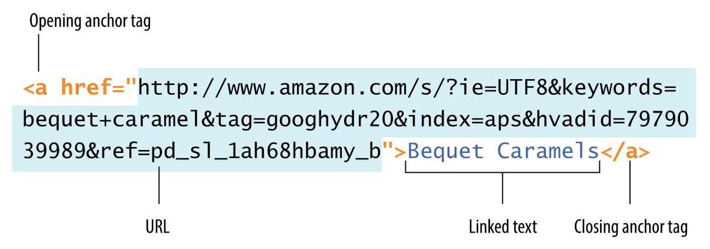
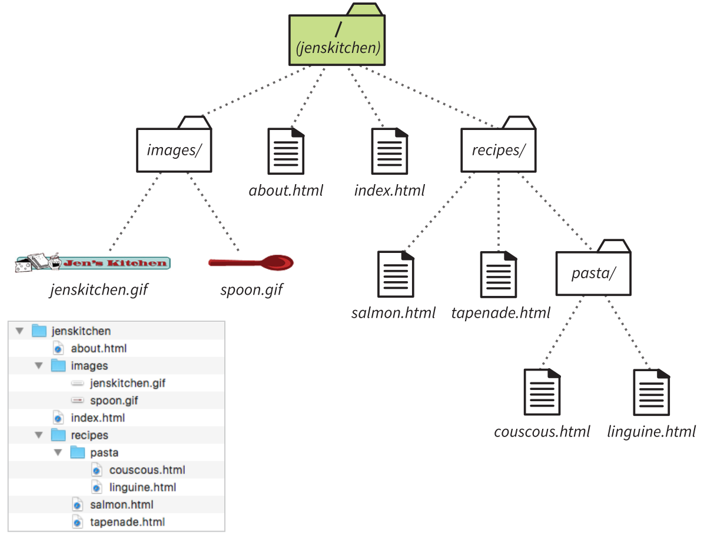

# Leksioni 3: Listat dhe links në HTML

## Elementër block dhe inline

Në HTML, termat **"block elements"** dhe **"inline elements"** përshkruajnë sjelljen e elementëve kur ata shfaqen në një faqe web. Këto kategori përcaktojnë si vendosen elementët përkrah njëri-tjetrit, si zënë hapësirën dhe si ndikojnë në rrjedhën e përmbajtjes në faqe.

### Block Elements
"Block elements" janë elementë që:
- **Zënë një rresht të plotë horizontalisht**: Çdo element tjetër që vjen pas tyre shfaqet në një rresht të ri, duke krijuar një ndarje vizuale.
- **Zgjaten për të zënë të gjithë gjerësinë** e kontejnerit të tyre (p.sh., `div`, `body`, ose një kontejner tjetër block).
- **Përdoren për struktura dhe ndarje të përmbajtjes**: Shpesh përdoren për ndarjen e seksioneve në një faqe për t’i bërë ato të organizuara dhe të lexueshme.

#### Shembuj të Block Elements:
1. **`<div>`**: Kontejner që përdoret për të grupuar elementë të ndryshëm dhe për të krijuar seksione.
2. **`<p>`**: Përdoret për paragrafe teksti.
3. **`<h1>`, `<h2>`,... `<h6>`**: Tituj që tregojnë nivele të ndryshme hierarkike të përmbajtjes.
4. **`<ul>`, `<ol>`, `<li>`**: Elementët e listave të renditura dhe të parenditura.

#### Karakteristika të tjera:
- **Përdorin atribute si** `width`, `height`, `margin`, dhe `padding` për të menaxhuar madhësinë dhe pozicionimin.
- **Nisin në një vijë të re** dhe e mbajnë përmbajtjen tjetër poshtë.

---

### Inline Elements
"Inline elements" janë elementë që:
- **Zënë vetëm aq hapësirë sa përmbajtja e tyre**: Ndryshe nga block elements, inline elements nuk zënë një linjë të plotë.
- **Nuk ndërpresin rrjedhën e tekstit**: Shfaqen pranë elementëve të tjerë në të njëjtin rresht, duke krijuar një rrjedhë të pandërprerë.
- **Përdoren shpesh për stilizim të brendshëm ose për theksim të tekstit**: Për shembull, për të vendosur links, theksuar fjalë ose për të stilizuar pjesë të veçanta të tekstit.

#### Shembuj të Inline Elements:
1. **`<span>`**: Një kontejner për stilizimin e pjesëve të tekstit brenda një blloku.
2. **`<a>`**: Elementi për lidhje hipertext.
3. **`<strong>`, `<em>`**: Për të theksuar ose italicizuar pjesë të tekstit.
4. **``**: Për futjen e imazheve.

#### Karakteristika të tjera:
- **Inline elements nuk lejojnë** `width` ose `height` të ndryshojë madhësinë e tyre.
- **Stilizohen kryesisht përmes** `color`, `font-size`, `margin` (vetëm majtas dhe djathtas), dhe `padding` (në pjesë të kufizuara).

---

### Krahasimi mes Block dhe Inline Elements

| Veçori | Block Elements | Inline Elements |
| ------ | -------------- | --------------- |
| Hapësira që zënë   | Zënë gjithë rreshtin                     | Zënë vetëm përmbajtjen e tyre          |
| Sjellja e rreshtit | Nisin në vijë të re                    | Qëndrojnë në të njëjtën linjë          |
| Shembuj            | `<div>`, `<p>`, `<h1>` - `<h6>`       | `<span>`, `<a>`, `<strong>`, `<em>`    |
| Kontrolli CSS      | Mund të kontrollohen `width`, `height` | Stilet kufizohen kryesisht në tekst    |


### Listat në HTML

HTML ofron elemente për krijimin e tre llojeve të listave që përputhen me mënyrën natyrore të njerëzve për të organizuar informacionin:

1. **Listat e parregulluara (unordered lists)** – Përdoren për grupe elementesh pa një renditje specifike.
2. **Listat e renditura (ordered lists)** – Përdoren kur renditja e elementeve ka rëndësi.
3. **Listat e përshkrimeve (description lists)** – Për çifte term-vlerë, të tilla si terma dhe përkufizime.

Të gjitha elementet e listave janë të tipit *block element*, pra fillojnë në një rresht të ri dhe kanë hapësirë sipër dhe poshtë tyre. Këto mund të ndryshohen përmes CSS-së. Më poshtë do të shqyrtojmë secilin tip liste.

---

## Listat e Parregulluara (Unordered Lists)

Këto lista përfshijnë elemente që nuk ndjekin një rend të caktuar. Në mënyrë të paracaktuar, secili element i listës shfaqet me një shenjë rrethore (bullet).

#### Sintaksa për Listën e Parregulluar
- Përdorni elementin `<ul>` për të krijuar një listë të parregulluar.
- Çdo element i listës duhet të vendoset brenda tag-ave `<li>`.
- Browser-i e shton automatikisht simbolin rrethor.

**Shembull:**
```html
<ul>
    <li>Gjuhë Shqipe</li>
    <li>Matematikë</li>
    <li>TIK</li>
    <li>Histori</li>
    <li>Biologji</li>
</ul>
```

> **Kujdes:** Brenda një liste të parregulluar lejohet vetëm vendosja e elementeve `<li>`. Nuk mund të fusni elemente të tjera apo tekst jashtë këtyre elementeve.

Për tag-un `<ul>`, ka vetëm disa atribute të mundshme për të ndryshuar pamjen dhe funksionalitetin e listës pa përdorur CSS. Këto atribute janë të kufizuara dhe përfshijnë vetëm disa opsione të thjeshta.

### Atributet e Disponueshme për `<ul>`

1. **`type`**
   - Atributi `type` përcakton stilin e shenjës së listës për elementët e listës.
   - Opsionet e mundshme për `type`:
     - `disc` – (default) përdor një pikë të zezë si shenjë për secilin element.
     - `circle` – përdor një rreth bosh si shenjë.
     - `square` – përdor një katror të mbushur si shenjë.

   **Shembull:**

   ```html
   <ul type="circle">
       <li>Element i listës me rreth</li>
       <li>Një tjetër element</li>
   </ul>
   ```

2. **`id`**
   - Atributi `id` përdoret për të dhënë një identifikues unik për listën. Ky atribut nuk ndikon drejtpërdrejt në pamjen vizuale, por mund të përdoret për të dalluar listën kur është e nevojshme për qëllime të ndryshme në JavaScript ose stilizim të mëtejshëm.
   
   **Shembull:**

   ```html
   <ul id="myUniqueList">
       <li>Element i parë</li>
       <li>Element i dytë</li>
   </ul>
   ```

3. **`class`**
   - Atributi `class` përdoret për të specifikuar një ose më shumë klasa për listën, të cilat mund të ndihmojnë në identifikimin ose stilizimin e listës në mënyrë të veçantë.
   - Ndërsa `class` nuk ndryshon direkt pamjen, ajo lejon grupimin e listave të ngjashme në HTML.

   **Shembull:**

   ```html
   <ul class="important-list">
       <li>Element i listës i rëndësishëm</li>
       <li>Element i listës tjetër</li>
   </ul>
   ```

4. **`style`** (edhe pse është përdorim i kufizuar i CSS)
   - Atributi `style` përdoret për të aplikuar stile inline direkt mbi tag-un `<ul>`. Edhe pse është teknikisht një atribut, përdoret për të vendosur stilizime CSS në të njëjtën linjë dhe nuk është rekomanduar për strukturimin e faqes pa CSS.
   - Ky atribut zakonisht përdoret për stilizime të shpejta, por nuk është standard për stilizim në përmbajtje HTML.

**Shembull i Kombinimit të Këtyre Atributeve:**

```html
<ul type="square" id="myUniqueList" class="highlighted-list">
    <li>Element i listës i parë</li>
    <li>Element i listës i dytë</li>
</ul>
```

Këto janë atributet kryesore që mund të përdoren me tag-un `<ul>` në HTML.

---

## Listat e Renditura (Ordered Lists)

Këto lista përdoren për elemente me renditje specifike, si për shembull udhëzime hap-pas-hapi. Përdorni elementin `<ol>` për të krijuar një listë të renditur. Browser-i shton numra automatikisht për çdo element të listës.

#### Sintaksa për Listën e Renditur
- Çdo element i listës duhet të vendoset brenda tag-ave `<li>`.
- Duke përdorur atributin `start`, lista mund të fillojë nga një numër i caktuar.

**Shembull:**
```html
<ol>
    <li>Kliko butonin PRINT.</li>
    <li>Zgjigj printerin.</li>
    <li>Kliko SAVE.</li>
</ol>
```

### Atributet për listat `<ol>`
Tag-u `<ol>` ka disa atribute që mund të përdoren për të kontrolluar numërimin dhe stilin e listave të renditura në HTML.

1. **`type`**
   - Atributi `type` përcakton formatin e numërimit për elementët e listës së renditur.
   - Opsionet e mundshme për `type` janë:
     - `1` – Numra (numërim me numra të plotë: 1, 2, 3, ...)
     - `A` – Shkronja të mëdha (A, B, C, ...)
     - `a` – Shkronja të vogla (a, b, c, ...)
     - `I` – Numra romakë me shkronja të mëdha (I, II, III, ...)
     - `i` – Numra romakë me shkronja të vogla (i, ii, iii, ...)

   **Shembull:**

   ```html
   <ol type="A">
       <li>Element i parë</li>
       <li>Element i dytë</li>
   </ol>
   ```

2. **`start`**
   - Atributi `start` përcakton numrin fillestar për elementin e parë të listës.
   - Ky atribut është i dobishëm nëse dëshironi që numërimi të fillojë nga një numër tjetër përveç "1".

   **Shembull:**

   ```html
   <ol start="5">
       <li>Element i pestë</li>
       <li>Elementi i gjashtë</li>
   </ol>
   ```

3. **`reversed`**
   - Ky atribut përdoret për të renditur listën në mënyrë të zbritshme, nga një numër më i madh në një numër më të vogël.
   - Kur vendoset, lista fillon nga numri më i lartë dhe përfundon me numrin më të ulët.

   **Shembull:**

   ```html
   <ol reversed>
       <li>Elementi i fundit</li>
       <li>Elementi parafundit</li>
   </ol>
   ```

4. Atributet `id`, `class` dhe `style` kanë të njëjtin funksionin për të gjithë elementët në HTML.

**Shembull i Kombinimit të Këtyre Atributeve:**

```html
<ol type="I" start="3" reversed class="numbered-list">
    <li>Element i tretë</li>
    <li>Element i dytë</li>
</ol>
```

---

## Listat e Përshkrimeve (Description Lists)

Këto lista përdoren për të paraqitur çifte term-vlerë, si terma dhe përkufizime. Për të krijuar një listë të tillë përdorni elementin `<dl>`. Termat vendosen brenda tag-ave `<dt>`, ndërsa përshkrimet brenda tag-ave `<dd>`.

#### Sintaksa për Listën e Përshkrimeve
- Lista duhet të përmbajë vetëm elementet `<dt>` dhe `<dd>`.

**Shembull:**
```html
<dl>
    <dt>Linotype</dt>
    <dd>Teknologjia e llojit linotip përmirësoi shpejtësinë e shtypshkrimit.</dd>
    <dt>Fotokompozimi</dt>
    <dd>Tekstet shfaqen në filma dhe projektuesit rregullojnë madhësinë.</dd>
    <dt>Tipi dixhital</dt>
    <dd>Shënimi dixhital ruan skicat dhe mund të shkallëzohet për çdo madhësi.</dd>
</dl>
```

**Kujdes:** Në elementin `<dt>` nuk lejohet vendosja e paragrafëve apo përmbajtje grupuese, ndërsa brenda `<dd>` mund të përfshihen të gjitha llojet e përmbajtjeve që rrjedhin.

### Atributet për `<dl>`, `<dt>`, dhe `<dd>`

Listat e përshkrimeve (`<dl>`, `<dt>`, dhe `<dd>`) në HTML kanë disa atribute të zakonshme që mund të përdoren për të personalizuar stilin dhe funksionalitetin e tyre. Megjithëse këto elemente nuk kanë atribute specifike të dedikuara vetëm për to, mund të përdoren atribute të përgjithshme të HTML që aplikohen për shumicën e elementeve. Këto përfshijnë:

1. **`title`**
   - Atributi `title` tregon një tekst ndihmues që shfaqet kur përdoruesi e kalon kursorin mbi elementin.

   **Shembull:**
   ```html
   <dl title="Lista e Përshkrimeve">
       <dt title="Një teknologji për shtypshkrim">Linotype</dt>
       <dd title="Përmirësim i shpejtësisë së shtypshkrimit">Teknologjia e llojit linotip përmirësoi shpejtësinë e shtypshkrimit.</dd>
   </dl>
   ```

2. **`lang`**
   - Ky atribut përdoret për të specifikuar gjuhën e përmbajtjes së elementit, e cila mund të jetë e dobishme për lexuesit e ekranit dhe për motorët e kërkimit.

   **Shembull:**
   ```html
   <dl lang="sq">
       <dt>Linotype</dt>
       <dd>Teknologjia e llojit linotip përmirësoi shpejtësinë e shtypshkrimit.</dd>
   </dl>
   ```

3. **`dir`**
   - Atributi `dir` përcakton drejtimin e tekstit dhe mund të ketë vlera `ltr` (majtas-djathtas) ose `rtl` (djathtas-majtas).

   **Shembull:**
   ```html
   <dl dir="ltr">
       <dt>Fotokompozimi</dt>
       <dd>Tekstet shfaqen në filma dhe projektuesit rregullojnë madhësinë.</dd>
   </dl>
   ```

### Shembull i Kombinimit të Këtyre Atributeve

```html
<dl id="my-description-list" class="highlighted-list" lang="sq" title="Një listë përshkrimesh">
    <dt class="term" style="color: blue;" title="Përkufizimi i linotipit">Linotype</dt>
    <dd class="definition" dir="ltr" style="font-style: italic;">Teknologjia e llojit linotip përmirësoi shpejtësinë e shtypshkrimit.</dd>
    <dt class="term" title="Përshkrimi i fotokompozimit">Fotokompozimi</dt>
    <dd class="definition">Tekstet shfaqen në filma dhe projektuesit rregullojnë madhësinë.</dd>
</dl>
```


### Krijimi i Listave të mbivendosura

Në HTML, krijimi i listave të mbivendosura (ose "nested lists") bëhet duke vendosur një listë brenda një elementi `<li>` të listës prindërore. Kjo është një teknikë që lejon organizimin hierarkik të informacionit, duke i bërë të lehta për t'u lexuar listat komplekse. Ja disa detaje dhe shembuj se si funksionon:

- **Lista të mbivendosura të renditura** (`<ol>`): Nëse futni një listë të renditur (`<ol>`) brenda një elementi `<li>` të një liste tjetër të renditur, lista brenda nuk do të ndryshojë automatikisht stilin e numërimit.
- **Lista të mbivendosura të parenditura** (`<ul>`): Kur futni një listë të parenditur (`<ul>`) brenda një elementi `<li>`, shenjat e listës (`bullet points`) të listës së brendshme ndryshojnë automatikisht në një stil të ri për të dalluar nivelet.

### Shembull për Lista të Folezuara

**Lista e Renditur me një Listë të Parenditur të Folezuar:**

```html
<ol>
    <li>Antipasti</li>
    <li>
        Pjata kryesore
        <ul>
            <li>Pasta</li>
            <li>Pizza</li>
            <li>Risotto</li>
        </ul>
    </li>
    <li>Dessert</li>
</ol>
```

Në këtë shembull:
- Kemi një listë të renditur (`<ol>`) me tre elemente kryesore.
- Elementi i dytë (`Pjata kryesore`) përmban një listë të parenditur (`<ul>`), e cila shton nënkategoritë si `Pasta`, `Pizza`, dhe `Risotto`.

**Lista të Folezuara të Parenditura:**

```html
<ul>
    <li>Mousses</li>
    <li>
        Pastries
        <ul>
            <li>Croissant</li>
            <li>Mille-feuille</li>
            <li>Palmier</li>
            <li>Profiterole</li>
        </ul>
    </li>
    <li>Tarts</li>
</ul>
```

Në këtë shembull:
- Lista e parenditur (`<ul>`) ka tre kategori kryesore.
- E dyta, `Pastries`, përmban një listë të parenditur të folezuar me artikuj të ndryshëm.

### Vërejtje për Pamjen e Listave të Folezuara

- **Indentimi**: Shfletuesit zakonisht e tregojnë listën e folezuar me një indentim të shtuar, për të bërë të dallueshme listën e folezuar nga lista prindërore.
- **Stilet e Shenjave**: Për listat të parenditura, shfletuesi automatikisht ndryshon stilin e shenjave (p.sh., nga pika të mbushura në pika të zbrazëta) për të dalluar listën e folezuar.

## Links në HTML

Linkimi është një nga bazat e internetit, duke lidhur faqe dhe burime në të njëjtin sajt ose në të tjerë. Në HTML, për të krijuar një link përdorim elementin **anchor (`<a>`)**, i cili përfshin atributin `href` për të treguar URL-në e faqes ose burimit.

### Sintaksa e Elementit `<a>`

Për të krijuar një link në tekst, duhet të vendosim tekstin brenda tag-ave `<a>...</a>`, duke përdorur `href` për të treguar URL-në e destinacionit. Për shembull:

```html
<a href="http://www.oreilly.com">Shko te faqja O'Reilly Media</a>
```

### Atributi `href`

Atributi `href` është ajo që i tregon browser-it dokumentin ku do të lidhet. URL-ja e dhënë duhet të jetë gjithmonë e vendosur në thonjëza. URL-të mund të jenë **lidhje absolute** ose **lidhje relative**.

- **URL Absolute**: Tregon adresën e plotë të dokumentit, përfshirë protokollin (`http://`), emrin e domain-it dhe PATH-in e plotë. Kjo përdoret kur lidhja drejtohet në faqe të tjera jashtë faqes së vet.

  ```html
  <a href="http://www.google.com/">Faqja Google.com</a>
  ```

- **URL Relative**: Përshkruan PATH-in deri te një dokument në të njëjtin server. Përdoret për të lidhur faqe brenda të njëjtit sajt.

  ```html
  <a href="recipes/index.html">Recetat e Kuzhinës</a>
  ```

#### URL vs URI

Shpesh përdoren termat si **URI** (Uniform Resource Identifier) dhe **URL** (Uniform Resource Locator). URL është një nënkategori e URI që përcakton burimin nga vendndodhja e tij specifike në rrjet. Pra, çdo URL është një URI, por jo çdo URI është një URL.

<br>
*Figura 1: Një shembull i një URL-je të gjatë.*

### Lidhja midis faqeve të web-it

Në shumë raste, mund të dëshironi të krijoni një lidhje për një faqe që keni gjetur në internet. Ky lloj lidhjeje quhet **external link**, sepse drejtohet në një faqe jashtë serverit ose faqes tuaj. Për të krijuar një lidhje eksternale, përdorni **URL-në absolute**, e cila fillon me **`http://`** (protokolli). Kjo i thotë browser-it, **"Shko në internet dhe merr dokumentin e mëposhtëm."**


Në këtë shembull, do të shtojmë një lidhje eksternale për **"The Food Network"** në faqen kryesore të "Jen’s Kitchen".

1. **Krijimi i lidhjes me përdorimin e elementeve të listës**: 
   Fillimisht, do të krijojmë një listë dhe brenda saj vendosim lidhjen për "The Food Network". Elementët **`<a>`** do të vendosen brenda një elementi **`<li>`** (list item), sepse vetëm **`<li>`** mund të jetë fëmijë i një **`<ul>`** (unordered list). Vendosja e një elementi **`<a>`** direkt brenda një **`<ul>`** do të ishte e pavlefshme.

   ```html
   <li><a>The Food Network</a></li>
   ```

2. **Shtimi i atributit `href` për URL-në absolute**: 
   Tani, për të bërë lidhjen funksionale, shtojmë atributin **`href`** me URL-në e plotë të faqes që duam të lidhim (për këtë rast, **www.foodnetwork.com**):

   ```html
   <li><a href="http://www.foodnetwork.com">The Food Network</a></li>
   ```

3. **Rezultati**: 
   Tani, kur dikush klikoni ose prek tekstin **"The Food Network"**, ata do të drejtohen në faqen përkatëse të **www.foodnetwork.com**.

### Linkimi brenda faaqes suaj

Në ndërtimin e një faqeje web, shpesh do të lidheni nga një faqe e faqes tuaj në tjetrën—nga faqja kryesore në faqet e seksioneve, nga faqet e seksioneve në faqet me përmbajtje, etj. Në këto raste, **mund të përdorni një URL relative** që referohet në një dokument të pranishëm në serverin tuaj.

> Në zhvillimin web, termi "directory" përdoret shpesh për të përshkruar dosjet në të cilat organizohen skedarët dhe faqet. Termi "folder" shpesh përshkruan të njëjtën gjë, por me një ikonë vizuale.


PATH-i relativ tregon se si të arrihet dokumenti i lidhur duke filluar nga pozicioni i dokumentit aktual. Kjo bëhet duke përdorur shenjën **`/` për të ndarë direktorite dhe emrat e skedarëve**. Disa rregulla janë të rëndësishme për të shmangur gabimet kur përdorni këto shtigje:

1. **Mos përdorni shenjën `\`** (backslash). Në URL-të web përdoret vetëm ` / ` (forward slash).
  
2. **Mos përfshini emrin e diskut** (p.sh., C:, D:) për fillimin e URL-së. Këto funksionojnë vetëm në kompjuterin tuaj lokal dhe do të prishin lidhjet kur faqja ngarkohet në server.

3. **Mos përdorni `file://`** në fillim të URL-së, pasi kjo tregon që skedari është lokal dhe do të shkaktojë gabime kur ngarkohet në server.

#### Struktura e Direktorive të Faqes

Në shembullin e faqes "Jen's Kitchen", rrënja e faqes është dosja **`jenskitchen/`** dhe përmban disa sub-direktorite si **`recipes/`** dhe **`images/`**. Çdo dokument referohet nga rruga relative bazuar në këtë strukturë (si një pemë përmbysur), duke filluar nga rrënja (root):

 <br>
*Figura 2 - Struktura e website-it jenskitche.n*


### Shembuj të Rrugëve Relative

- **Për të lidhur nga `index.html` te `about.html`**: 

  ```html
  <a href="about.html">Rreth Nesh</a>
  ```

- **Për të lidhur nga `index.html` në `recipes/salmon.html`**:

  ```html
  <a href="recipes/salmon.html">Receta Salmoni</a>
  ```

- **Për të lidhur nga `recipes/pasta/spoon.gif` te `index.html`** (duke kaluar një nivel më lart):

  ```html
  <a href="../index.html">Faqja Kryesore</a>
  ```

- **Për të lidhur nga `recipes/salmon.html` te `recipes/tapenade.html`** (brenda të njëjtës direktori):

  ```html
  <a href="tapenade.html">Receta Tapenade</a>
  ```

Këto shembuj përdorin PATH-e relative për të përshkruar vendndodhjen e faqeve dhe skedarëve brenda të njëjtit server. Kjo është një praktikë standarde në zhvillimin web dhe lejon që lidhjet të funksionojnë siç duhet edhe pas ngarkimit të faqes në një server të ri.

## Bookmark në HTML

A e dini që mund të lidheni me një pikë të caktuar brenda një faqeje në internet? Kjo është e dobishme për të siguruar shkurtore për informacionin në fund të një faqeje të gjatë ose për t'u kthyer në krye të faqes me një klikim ose prekje. Lidhja me një pikë specifike brenda faqes njihet gjithashtu si **lidhja me një fragment dokumenti** ose **Bookmark**.  

> **SHËNIM**
Lidhja me një vend tjetër brenda të njëjtës faqe funksionon mirë për faqe të gjata, por efekti mund të humbasë në faqe të shkurtra.  

## Procesi në Dy Faza për Lidhjen me një Pikë të Caktuar:  

1. **Identifikimi i Destinacionit:**  
   Fillimisht, caktohet një destinacion duke përdorur atributin `id` për të dhënë një emër unik elementit të synuar në dokument. Ky është identifikuesi i fragmentit.  

   **Shembull:** Për të lejuar përdoruesit të lidhen drejtpërdrejt me seksionin "H" të një fjalori, mund të shtojmë një atribut `id` te titulli:  
   ```html
   <h2 id="startH">H</h2>
   ```  

2. **Krijimi i Lidhjes:**  
   Pastaj, krijohet një lidhje duke përdorur simbolin `#` përpara emrit të fragmentit.  
   **Shembull:**  
   ```html
   <p>... F | G | <a href="#startH">H</a> | I | J ...</p>
   ```  
   Kur klikoni në "H", browser-i do të kalojë te seksioni me id-në `startH`.  


### Lidhja me një Fragment në një Dokument Tjetër  

Për të krijuar një lidhje me një fragment në një dokument tjetër, shtoni emrin e fragmentit në fund të URL-së.  
**Shembull:**  
```html
<a href="glossary.html#startH">Shiko Glossary, shkronja H</a>
```  

Gjithashtu, mund të lidheni me fragmente në faqe të tjera duke përdorur URL absolut:  
```html
<a href="http://www.example.com/glossary.html#startH">Shiko Glossary, shkronja H</a>
```  


### Këshilla për Përdorshmëri:  
- **Lidhje në Krye:** Nëse faqja është e gjatë, shtoni një lidhje në fund të çdo seksioni që të çon përsëri në krye.  
  **Shembull:**  
  ```html
  <p><a href="#top">Kthehu në krye</a></p>
  ```  


### Hapja e Lidhjeve në një Dritare ose Tab të Ri  

Për të hapur një lidhje në një dritare ose tab të ri, përdorni atributin `target` në elementin `<a>`.  
- Për të hapur një dritare të re çdo herë:  
  ```html
  <a href="http://www.oreilly.com" target="_blank">O'Reilly</a>
  ```  
- Për të përdorur të njëjtën dritare për disa lidhje:  
  ```html
  <a href="http://www.oreilly.com" target="display">O'Reilly</a>
  ```  


### Lidhjet e Postës Elektronike  

Mund të krijoni një lidhje për të hapur një email të ri duke përdorur protokollin `mailto`:  
```html
<a href="mailto:example@example.com">Kontakto</a>
```  
**Kujdes:** Vendosja e adresave të emailit në HTML mund t'i ekspozojë ato ndaj spam-it. Për të shmangur këtë, përdorni një formular kontakti ose enkriptim të adresës me JavaScript.  


### Lidhje për Telefon  

Në pajisjet mobile, mund të krijoni lidhje që mundësojnë thirrje telefonike duke përdorur protokollin `tel`:  
```html
<a href="tel:+355123456789">Thirrni Tani</a>
```  

Këto janë disa nga teknikat dhe konsideratat kryesore për të krijuar lidhje efektive dhe të përshtatshme për përdoruesit.

## Çfarë trajtuam në këtë leksion?

### 1. **Elementët Block dhe Inline në HTML**
- **Elementët Block**:
  - Zënë një rresht të plotë horizontalisht.
  - Zgjaten për të mbushur gjithë gjerësinë e kontejnerit.
  - Përdoren për të strukturuar dhe ndarë përmbajtjen.
  - Shembuj: `<div>`, `<p>`, `<h1>` deri në `<h6>`, `<ul>`, `<ol>`, etj.
  
- **Elementët Inline**:
  - Nuk krijojnë ndarje në rresht të ri; qëndrojnë përkrah elementëve të tjerë.
  - Marrin vetëm hapësirën e nevojshme për përmbajtjen e tyre.
  - Shembuj: `<span>`, `<a>`, `<strong>`, `<em>`, etj.

---

### 2. **Listat në HTML**
- **Listat e Renditura (`<ol>`)**:
  - Shfaqin elementët me numërim.
  - Përdoren për përmbajtje me rend logjik ose hap pas hapi.

- **Listat e Parenditura (`<ul>`)**:
  - Përdorin pika (bullets) për të shfaqur elementët.
  - Ideale për lista pa rend specifik.

- **Elementët e Listave (`<li>`)**:
  - Përdoren brenda listave të renditura dhe të parenditura për të shtuar artikuj.

---

### 3. **Lidhjet në HTML**
- **Elementi `<a>`**:
  - Përdoret për të krijuar lidhje.
  - Atributi `href` përcakton URL-në e destinacionit.
  - Shembuj: Lidhje te faqe të tjera, dokumente, ose seksione brenda të njëjtës faqe (`#anchor`).

## Ushtrime 

Më poshtë janë disa ushtrime praktike në HTML që lidhen me tematikën e leksionit. Ato janë të organizuara sipas niveleve të vështirësisë për të ndihmuar studentin të ushtrojë dhe kuptojë më mirë konceptet.

### Ushtrimi 1: Krijo një listë të parenditur
Krijo një listë të parenditur që përmban ushqimet e preferuara, si p.sh.:
- Pizza  
- Sallatë  
- Hamburger  

**Rezultati i pritur në HTML**:
```html
<!DOCTYPE html>
<html>
<head>
    <title>Lista e Ushqimeve</title>
</head>
<body>
    <h1>Ushqimet e Mia të Preferuara</h1>
    <ul>
        <li>Pizza</li>
        <li>Sallatë</li>
        <li>Hamburger</li>
    </ul>
</body>
</html>
```

### Ushtrimi 2: Krijo një listë të renditur për hapat e një recete
Përshkruaj një recetë ku secili hap tregohet me një numër. P.sh.:
1. Prit përbërësit.  
2. Gatuaj në zjarr mesatar.  
3. Shërbe në pjatë.

**Rezultati i pritur në HTML**:
```html
<!DOCTYPE html>
<html>
<head>
    <title>Receta e Supës</title>
</head>
<body>
    <h1>Hapat për Supë</h1>
    <ol>
        <li>Prit përbërësit.</li>
        <li>Gatuaj në zjarr mesatar.</li>
        <li>Shërbe në pjatë.</li>
    </ol>
</body>
</html>
```

### Ushtrimi 3: Kombino një listë të renditur dhe të parenditur
Krijo një listë për të treguar planin e një udhëtimi:
1. Përgatit gjërat që do të marrësh:
   - Rroba
   - Dokumente
   - Pajisje elektronike
2. Rezervo biletat.  
3. Shijo udhëtimin!

**Rezultati i pritur në HTML**:
```html
<!DOCTYPE html>
<html>
<head>
    <title>Plani i Udhëtimit</title>
</head>
<body>
    <h1>Plani i Udhëtimit</h1>
    <ol>
        <li>
            Përgatit gjërat që do të marrësh:
            <ul>
                <li>Rroba</li>
                <li>Dokumente</li>
                <li>Pajisje elektronike</li>
            </ul>
        </li>
        <li>Rezervo biletat.</li>
        <li>Shijo udhëtimin!</li>
    </ol>
</body>
</html>
```

### Ushtrimi 4: Krijo lidhje që navigojnë te seksione brenda faqes
Krijo një faqe me tre seksione (Hyrje, Rreth Nesh, dhe Kontakt), ku një menu navigimi në krye të faqes të lejojë kalimin te secili seksion.

**Rezultati i pritur në HTML**:
```html
<!DOCTYPE html>
<html>
<head>
    <title>Faqja Ime</title>
</head>
<body>
    <h1>Faqja Ime</h1>
    <nav>
        <a href="#hyrje">Hyrje</a> |
        <a href="#rreth-nesh">Rreth Nesh</a> |
        <a href="#kontakt">Kontakt</a>
    </nav>

    <h2 id="hyrje">Hyrje</h2>
    <p>Mirë se vini në faqen tonë!</p>

    <h2 id="rreth-nesh">Rreth Nesh</h2>
    <p>Ne jemi një kompani që ofrojmë shërbime cilësore.</p>

    <h2 id="kontakt">Kontakt</h2>
    <p>Na kontaktoni në: info@shembull.com</p>
</body>
</html>
```

### Ushtrimi 5: Krijo një faqe për një dyqan me kategori të organizuara
Krijo një listë të parenditur për kategoritë e një dyqani (p.sh. Rroba, Elektronikë, Ushqime). Çdo kategori duhet të përmbajë një listë të renditur me produkte specifike.

**Rezultati i pritur në HTML**:
```html
<!DOCTYPE html>
<html>
<head>
    <title>Dyqani Ynë</title>
</head>
<body>
    <h1>Dyqani Ynë</h1>
    <ul>
        <li>Rroba
            <ol>
                <li>Këmisha</li>
                <li>Pantallona</li>
                <li>Jaketa</li>
            </ol>
        </li>
        <li>Elektronikë
            <ol>
                <li>Telefona</li>
                <li>Televizorë</li>
                <li>Laptopë</li>
            </ol>
        </li>
        <li>Ushqime
            <ol>
                <li>Fruta</li>
                <li>Perime</li>
                <li>Pije</li>
            </ol>
        </li>
    </ul>
</body>
</html>
```

### Ushtrimi 6: Krijo një menu navigimi me lidhje të jashtme
Krijo një faqe me një menu navigimi që përmban lidhje te faqet e tjera të njohura, si p.sh.:
- Google  
- YouTube  
- Wikipedia  

**Rezultati i pritur në HTML**:
```html
<!DOCTYPE html>
<html>
<head>
    <title>Menuja Naviguese</title>
</head>
<body>
    <h1>Faqet e Njohura</h1>
    <nav>
        <a href="https://www.google.com" target="_blank">Google</a> |
        <a href="https://www.youtube.com" target="_blank">YouTube</a> |
        <a href="https://www.wikipedia.org" target="_blank">Wikipedia</a>
    </nav>
</body>
</html>
```
