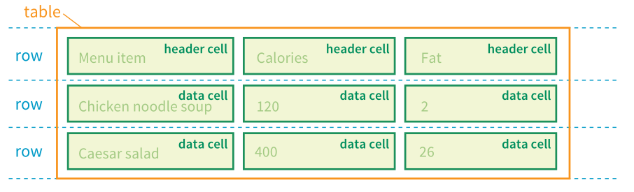
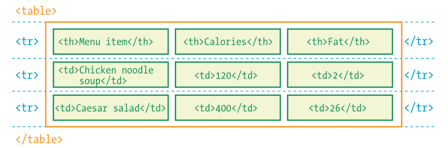

# Leksioni 4: Imazhet dhe Tabelat në HTML

## Imazhet në HTML

Para se të kalojmë te elementi ``, është e rëndësishme të kuptoni se nuk mund të përdorni çdo imazh në një faqe interneti; imazhi duhet të jetë në një nga formatet e mbështetura nga web-i.  

### Formate të mbështetura  

- **Imazhe raster (bitmapped)**: Këto janë imazhe të përbëra nga pikselë (shihni shembullin në Figurën 1). Për t’i përdorur këto në një faqe interneti, ato duhet të ruhen në formate si:  
  - PNG  
  - JPEG  
  - GIF  
  - WebP  
  - JPEG-XR  
  Formate si WebP dhe JPEG-XR janë më të reja dhe më të optimizuara, duke fituar popullaritet gradualisht.  

- **Imazhe vektoriale**: Për ikona dhe ilustrime, përdoret formati **SVG**. SVG është shumë i fuqishëm dhe kemi një kapitull të dedikuar, por në këtë kapitull do të shohim si t’i shtojmë ato në dokumentet HTML.


*Figura 1 - Imazhet Bitmap vs Imazhet Vektoriale*

### Konvertimi i Formateve të tjera  

Nëse keni një imazh burimor në një format tjetër (p.sh., TIFF, BMP, ose EPS), duhet ta konvertoni atë në një format të mbështetur nga web-i. Në rastet kur formati origjinal duhet ruajtur, mund ta ofroni imazhin si një skedar të jashtëm përmes një lidhjeje, si në shembullin:  

```html
<a href="architecture.eps">Shkarkoni vizatimin</a>
```  

### Emërtimi dhe Konfigurimi i Serverit  

- Sigurohuni që skedarët e imazheve të kenë prapashtesa të duhura, si:  
  - `.png`, `.jpg`, `.jpeg`, `.gif`, `.webp`, `.svg`.  
- Serverët zakonisht janë të konfiguruar për formatet PNG, JPEG, dhe GIF, por për SVG ose formate të reja mund të kërkohet një konfigurim shtesë.

### Zgjedhja e Imazheve për Faqen Tuaj  

- **Përdorni imazhe cilësore**: Imazhet e mira mund ta bëjnë një faqe të duket më profesionale dhe tërheqëse.  
- **Bleni fotografi stoku**: Shmangni shkeljen e të drejtave të autorit duke përdorur imazhe nga burime të besueshme, si:  
  - [www.istockphoto.com](http://www.istockphoto.com)  
  - [www.gettyimages.com](http://www.gettyimages.com)  
  - [www.fotolia.com](http://www.fotolia.com)  
  - [www.unsplash.com](http://www.unsplash.com)

### Organizimi i Imazheve në Faqe  

- **Ruani imazhet në një dosje të dedikuar**: Kjo e bën menaxhimin e skedarëve më të lehtë ndërsa faqja juaj rritet. P.sh., mund të përdorni strukturën:  

  ```plaintext
  /images  
      /interface  
      /products  
      /news  
  ```  

Në platformat CMS, ka vegla që e bëjnë menaxhimin e imazheve më të lehtë dhe organizojnë skedarët automatikisht.  

### Elementi `` në HTML  

Tani që dimë bazat, mund të kalojmë te elementi `` dhe atributet e tij kryesore, të cilat do t’i eksplorojmë më thellë në këtë kapitull. Praktikisht, elementi `` i thotë browser-it: *“Vendos një imazh këtu.”* Ky element është përdorur për të shtuar grafikë në faqe dhe mund të vendoset direkt në rrjedhën e tekstit.  

**Shembull:** Shiko skedarin [`imazhet.html`](code/imazhet.html)

```html
<p>Këtë verë, provoni të bëni pica  në zgarën tuaj.</p>
```

Kur browser-i has elementin ``, ai dërgon një kërkesë në server për të marrë skedarin e imazhit dhe e shfaq atë në faqe. Në rrjete të shpejta, ky proces ndodh pothuajse menjëherë. Në rrjete të ngadalta, si ato mobile ose dial-up, ngarkimi i imazheve mund të zgjasë më shumë.  

### **Atributet e Duhura të ``**  

1. **`src`**: Tregon vendndodhjen e imazhit (URL-në).  
2. **`alt`**: Jep tekst alternativ që shfaqet nëse imazhi nuk ngarkohet.  

#### **Shembull:**

```html

```

### **Karakteristikat e Elementit ``**  

- **Element bosh**: Nuk ka përmbajtje brenda tij, vetëm atribute.  
- **Element inline**: Qëndron në të njëjtën linjë me tekstin, duke ndjekur rrjedhën e tij. Në dritare më të ngushta, rreshtat me imazhe përshtaten automatikisht me gjerësinë e re.  
- **Element i zëvendësuar**: Gjatë shfaqjes, zëvendësohet nga skedari i jashtëm (imazhi).  
- **Përdorimi i CSS**: Mund të ndryshoni shfaqjen e imazheve, t’i lundroni në të djathtë ose të majtë, të shtoni kufij, ose të rregulloni hapësirën rreth tyre.  

### **Vendndodhja e Imazhit me `src`**  

- Nëse imazhi është në të njëjtën dosje me dokumentin HTML:  

  ```html
  
  ```

- Nëse është në një nën-dosje:  

  ```html
  
  ```

- Nëse imazhi është nga një faqe tjetër (jo e rekomanduar):  

  ```html
  
  ```  

#### **Kujdes**  

- Sigurohuni që imazhet që përdorni të jenë pronë juaja, të keni leje për përdorim, ose të jenë në domenin publik.  
- **Mos përdorni hotlinking** (lidhjen direkte me një imazh nga një server tjetër) përveç rasteve kur keni leje eksplicite.  

### **Përdorimi i Cache për Shpejtësi**  

Kur një browser shkarkon një imazh, ai e ruan atë përkohësisht në disk (cache). Kjo shpejton shfaqjen e faqes herën tjetër dhe redukton trafikun në server.

- Përdorni të njëjtin URL për imazhet e përsëritura në një faqe për të përfituar nga cache.  

**Shembull:**

```html

<p></p>
```

Imazhi shkarkohet vetëm një herë dhe përdoret nga cache për thirrjet e tjera.

### **Teksti Alternativ me `alt`**  

Atributi `alt` në elementin `` ofron një përshkrim tekstual të imazhit për përdoruesit që nuk mund ta shohin atë. Kjo përfshin përdoruesit e lexuesve të ekranit, motorët e kërkimit dhe ata që kanë çaktivizuar imazhet në browser-at e tyre.  

**Shembull:**

```html
<p>Nëse je  dhe e di këtë, duartrokit!</p>
```

**Kur është i domosdoshëm atributi `alt`?**  

1. **Përmbajtje informuese:** Nëse imazhi jep informacion të vlefshëm, teksti alternativ duhet të përshkruajë funksionin ose përmbajtjen e tij.  

   ```html
   <a href="aplikim.pdf">Aplikim për shkollë të mesme</a> 
   
   ```

2. **Funksioni si link:** Kur një imazh përdoret si lidhje, `alt` përshkruan destinacionin e linkut.  

   ```html
   <a href="http://learningwebdesign.com">
       
   </a>
   ```

3. **Dekorativ:** Nëse imazhi është thjesht dekorativ dhe nuk shton informacion të rëndësishëm, vlera e `alt` mund të lihet bosh.  

   ```html
   
   ```

### **Këshilla për Përdorimin e `alt`**  

- **Evito përshkrime si “imazh i” ose “grafik i.”** Është e qartë që bëhet fjalë për një imazh.  
- **Përmbajtje specifike:** Nëse është e rëndësishme, përfshini llojin e imazhit, p.sh., “fotografi,” “diagram,” “vizatim.”  
- **Mos përdorni `alt` për të rishkruar informacionin që është tashmë i qartë në tekst.**  

### **Vendosja e Përmasave me `width` dhe `height`**  

Atributet `width` dhe `height` përcaktojnë gjerësinë dhe lartësinë e imazhit në pikselë.  

- Këto ndihmojnë browser-in të rezervojë hapësirën për imazhin gjatë ngarkimit të faqes, duke e bërë shfaqjen më të shpejtë.  

**Shembull:**

```html

```

#### **Kujdes me përmasat**  

- Sigurohuni që përmasat e specifikuara përputhen me përmasat reale të imazhit.  
- Përndryshe, imazhi do të shtrihet ose tkurret dhe mund të duket i shtrembëruar ose i turbullt.

Në zhvillimin modern të web-it:  

- **Mos përdorni `width` dhe `height` për të ndryshuar përmasat.** Përdorni CSS ose një program për redaktimin e imazheve.  
- **Për imazhe responsive:** Përdorni teknika si `max-width` në CSS për të përshtatur madhësinë e imazhit sipas pajisjes.

Këto praktika ndihmojnë në ruajtjen e cilësisë së imazheve dhe përmirësojnë performancën e faqes.

## Rreshtimi i Imazheve në HTML

### Rreshtimi Horizontal (Kodi i Vjetër)

**Atributi `align`** më parë përdorej për të përcaktuar si do të rrjedhë teksti përreth një imazhi. Ky atribut është hequr në HTML5 dhe tani është e rekomanduar përdorimi i **CSS** për të rreshtuar imazhet. Megjithatë, është e dobishme të kuptoni se si përdorej në kodin më të vjetër pasi mund ta hasni ende në faqet ekzistuese ose në mjetet e redaktimit vizual.  

**Vlerat për rreshtimin horizontal:**

- **`left`**: Imazhi vendoset në të majtë dhe teksti rrjedh në anën e djathtë.  
- **`right`**: Imazhi vendoset në të djathtë dhe teksti rrjedh në anën e majtë.  

**Shembull:** Shiko skedarin [`align.html`](code/align.html)

```html
<p> 
  Ka rreth 10,000 specie të shpendëve që jetojnë në ekosisteme të ndryshme, nga Arktiku deri në Antarktik. Shumë prej tyre kryejnë migrime të gjata vjetore, ndërsa të tjera bëjnë udhëtime më të shkurtra.</p>

<hr />

<p>
  Ka rreth 10,000 specie të shpendëve që jetojnë në ekosisteme të ndryshme, nga Arktiku deri në Antarktik. Shumë prej tyre kryejnë migrime të gjata vjetore, ndërsa të tjera bëjnë udhëtime më të shkurtra.</p>
```

Këto rezultate duken më të rregullta krahasuar me vendosjen e një rreshti teksti ngjitur imazhit. Megjithatë, për një distancë më të mirë mes tekstit dhe imazhit, duhet të përdorni **CSS** me vetitë `margin` dhe `padding`.

#### Rreshtimi Vertikal (Kodi i Vjetër)

Atributi `align` gjithashtu përdorej për të rreshtuar një imazh vertikalisht krahas tekstit përreth. Edhe ky atribut është hequr në HTML5, dhe tani përdoret CSS për këtë qëllim.  

**Vlerat për rreshtimin vertikal:**

- **`top`**: Rreshti i parë i tekstit përafrohet me majën e imazhit.  
- **`middle`**: Rreshti i parë përafrohet me qendrën vertikale të imazhit.  
- **`bottom`**: Rreshti i parë përafrohet me fundin e imazhit.

**Shembull:**

```html
<p>
  Ka rreth 10,000 specie të shpendëve që jetojnë në ekosisteme të ndryshme.</p>

<hr />

<p>
  Ka rreth 10,000 specie të shpendëve që jetojnë në ekosisteme të ndryshme.</p>

<hr />

<p>
  Ka rreth 10,000 specie të shpendëve që jetojnë në ekosisteme të ndryshme.</p>
```

Për një qasje më moderne dhe fleksibël, rekomandohet përdorimi i CSS (vetitë si `vertical-align` dhe `float`).

## Çfarë duhet të dini më shumë?

### Rregulla për Përdorimin e Imazheve në Uebfaqe

1. **Ruani imazhet në formatin e duhur**  
   - JPEG, GIF, ose PNG janë formatet më të zakonshme.  
   - Formati i gabuar mund të ndikojë negativisht në cilësi dhe shpejtësi të ngarkimit.

2. **Ruani imazhet në madhësinë e duhur**  
   - Madhësia e imazhit duhet të përputhet me përmasat ku do të shfaqet.  

3. **Ruani imazhet me rezolucion të përshtatshëm**  
   - Rezolucioni për imazhet në ueb duhet të jetë 72 ppi për të shmangur skedarë të mëdhenj që ngarkohen ngadalë.

### Punimi me Imazhe Transparente

- **GIF Transparente**: Përshtatet për pjesë të drejta dhe plotësisht transparente.  
- **PNG Transparente**: Mbështet skaje diagonale, rrethoresh, dhe transparencë gjysmë të tejdukshme.  

### Punimi me **Animacione GIF**

**Animacionet GIF** përdorin një sekuencë kornizash për të krijuar animacione të thjeshta.  
Ato janë të dobishme për ilustrime të thjeshta, por jo ideale për fotografi për shkak të kufizimeve në ngjyrë dhe cilësi.

#### Si funksionojnë

1. Një **animacion GIF** përbëhet nga disa korniza që shfaqen njëra pas tjetrës.  
   - Shembull: Një pikë portokalli që rrotullohet rreth një rrethi.  
2. Çdo kornizë shton madhësinë e skedarit, duke ndikuar në kohën e shkarkimit të figurës.  
3. Mjetet si Adobe Photoshop ose faqe të tjera online mund të ndihmojnë për krijimin e tyre.

**Shembull përdorimi:**

- Përdorimi i animacioneve GIF duhet të jetë i matur për të shmangur efektin "amatore" që vjen nga përdorimi i tepruar.


*Figura 2 - Imazhet GIF*

### **Rezolucioni i Imazheve**

Rezolucioni i imazheve për uebfaqe zakonisht duhet të jetë **72 ppi (pixels per inch)**.  

- Kjo është rezolucioni maksimal që ekranet kompjuterike shfaqin për imazhet në ueb.  
- **Rezolucion më i lartë = Skedar më i madh** (ngarkim më i ngadalshëm i faqes).  

#### Dallimet mes rezolucioneve

- **300 dpi (dots per inch)**: Imazhe me cilësi të lartë për printime.  
- **72 ppi**: Rezolucion i optimizuar për ekranet digjitale.  

**Shembull krahasimi madhësish:**

- JPEG me **300 dpi**: 1.5 MB.  
- JPEG me **72 ppi**: 368 KB.  

Pra, për përdorim në ueb, gjithmonë duhet të ulni rezolucionin për të përmirësuar performancën e faqes suaj.

### **Imazhet Vektoriale**

**Imazhet vektoriale** krijohen nga pikë dhe linja mbi një rrjet.  

- **Avantazhi kryesor:** Mund të rrisni madhësinë e tyre pa humbur cilësinë.  
- Përdorime tipike: Logo, ilustrime, dhe diagrame.

#### Si përdoren në ueb

1. **Bitmap i eksportuar:** Deri vonë, imazhet vektoriale eksportoheshin si JPEG ose PNG për përdorim në ueb.  
2. **Formati SVG:** Formati i ri **Scalable Vector Graphics** lejon shfaqjen e vektorit direkt në uebfaqe.  
   - Mbështetja për SVG po rritet, por disa browser të vjetër ende kanë kufizime.

### **Cropping e Imazheve**

**Crop** është procesi i prerjes së një imazhi për t'i dhënë përmasat e duhura.  

- Kur e kryeni këtë proces, kini kujdes që të mos humbisni detaje të rëndësishme.

#### Shembuj të dobishëm

- **Portret:** Ilustrimi i një gjirafe është i përshtatshëm në pozicion portret. Nëse krojhet në një formë peizazhi, humbasim kokën ose këmbët e saj.  
- **Peizazh:** Ilustrimi i një elefanti përshtatet më mirë në pozicion peizazhi. Nëse krojhet në formë portreti, humbasim bishtin ose trungun.


*Figura 3 - Cropping*

**Këshillë:** Përdorni softuer të dedikuar për krojtje që ju lejon të ruani raportin origjinal të imazhit.

### Formate dhe Transparenca

#### GIF Transparente

- Përdoret kur pjesët transparente janë të drejta dhe 100% transparente.

#### PNG Transparente

- Mbështet skaje diagonale, rrethoresh, dhe transparencë gjysmë të tejdukshme.  
- Ka mbështetje më të mirë për efekte si hijet.  

## Imazhe Responsive në HTML

### Çfarë janë imazhet responsive?

Imazhet responsive janë mënyra për të ofruar variante të ndryshme të një imazhi për pajisje me madhësi dhe rezolucione të ndryshme ekrani. Browser-i zgjedh automatikisht versionin më të përshtatshëm të imazhit, bazuar në kushtet e shikimit si madhësia e ekranit, rezolucioni, shpejtësia e rrjetit dhe preferencat e përdoruesit.

Për shembull, një ekran me rezolucion të lartë (si një iPhone Retina) ka nevojë për një imazh më të detajuar se një ekran standard. Pa imazhe responsive, do të duhej të ngarkonit një imazh të madh për të gjithë, gjë që mund të ngadalësojë faqen dhe të rrisë kostot e të dhënave për përdoruesit në pajisje më të vogla.

Për të krijuar imazhe responsive përdorim atributet `srcset` dhe `sizes` në elementin `img`, ose elementin `picture`. Këto veçori janë pjesë e specifikimeve të **HTML5.1** dhe janë mbështetur nga shumica e browser-ave modernë.


*Figura 4*

#### Përdorimi i atributit `srcset`

Atributi `srcset` lejon të përcaktoni një listë burimesh të ndryshme imazhesh që browser-i mund të zgjedhë. Sintaksa është:

```html

```

Në këtë shembull:

- `1x` përdoret për pajisje standarde.
- `2x` dhe `3x` janë për pajisje me rezolucione më të larta.

Browser-i zgjedh automatikisht versionin e duhur bazuar në rezolucionin e ekranit.

**Shiko skedarin [`responsive.html`](code/responsive.html)**

##### Përdorimi i `srcset` dhe `sizes` për gjerësi të ndryshueshme

Kur imazhi ndryshon madhësinë në varësi të gjerësisë së dritares (viewport-it), përdorim atributin `sizes` për të treguar se sa hapësirë do të zërë imazhi në faqe. Ja një shembull:

```html

```

Shpjegim:

- `sizes` përcakton madhësinë relative të imazhit në faqe për gjerësi të ndryshme të viewport-it.
  - Në ekrane deri në **600px**, imazhi zë **100%** të gjerësisë së viewport-it.
  - Në ekrane deri në **1200px**, imazhi zë **50%**.
  - Për gjerësi më të mëdha, zë **33%**.

Browser-i përdor këto informacione për të zgjedhur versionin më të përshtatshëm nga lista në `srcset`.

#### Përdorimi i elementit `picture` për drejtim artistik

Kur përmbajtja e imazhit ndryshon bazuar në madhësinë e ekranit (p.sh., ndryshim në prerje ose orientim), përdorim elementin `picture`. Ja një shembull:

```html
<picture>
    <source media="(max-width: 600px)" srcset="imazh-portreti.jpg">
    <source media="(min-width: 601px)" srcset="imazh-landscape.jpg">
    
</picture>
```

Shpjegim:

- Përdorim elementin `source` për të përcaktuar burime të ndryshme të imazhit, bazuar në kushtet e ekranit.
- Elementi `img` shërben si opsion rezervë (fallback) për browser që nuk mbështesin `picture`.

## Imazhet SVG

### Çfarë është SVG?

- **SVG** (Scalable Vector Graphics) është një format imazhi vektorial që përdor forma, vija dhe tekste në vend të pikselëve. Imazhet përshkruhen duke përdorur gjuhën e shënimeve SVG, e cila lejon rritjen e cilësisë pa humbur detaje.
- Ndryshe nga imazhet raster (p.sh., JPG, PNG), imazhet SVG janë të pavarura nga rezolucioni dhe mund të zmadhohen pa humbur qartësinë, duke i bërë ato ideale për dizajne responsivë.

### Avantazhet e SVG

- **Performanca**: SVG-të zakonisht kanë një madhësi më të vogël të skedarëve krahasuar me imazhet raster, sepse ato ruajnë udhëzime dhe jo të dhëna pikseloze. Kjo çon në shkarkime më të shpejta.
- **Përshtatshmëria**: SVG-të mbajnë cilësi në çdo madhësi, gjë që është perfekte për layout-e responsivë.
- **Integrimi me tekstin**: SVG-të janë të bazuara në XML, prandaj mund të kompresohen, të stilizohen me CSS dhe të manipulohen me JavaScript.
- **Interaktiviteti**: JavaScript mund të përdoret për animimin ose ndërveprimin me elementët e SVG-së.

### Metodat për të përfshirë SVG-të

1. **Duke përdorur elementin `img`**:
   - **Markup**:  

     ```html
     
     ```

   - **Avantazhet**: E thjeshtë për t'u përdorur dhe mbështetet nga të gjithë browser modernë.
   - **Kundërshtitë**: Ka mundësi të kufizuara për stilizim dhe ndërveprim. Nuk mund të aksesoni ose manipuloni elementët brenda SVG-së me JavaScript. Nuk mund të aplikoni CSS për elementët e brendshëm të SVG-së.
   - **Mbështetje në browser**: E mbështetur nga të gjithë browser-it modernë, por jo nga versionet e vjetra të Internet Explorer (8 dhe më të hershme) dhe disa browser të vjetër celularë.

2. **SVG Inline (brenda HTML-së)**:
   - **Markup**:  

     ```html
     <svg xmlns="http://www.w3.org/2000/svg" viewBox="0 0 72 72">
         <circle fill="#D4AB00" cx="36" cy="36" r="36"/>
         <!-- Elementë të tjerë SVG këtu -->
     </svg>
     ```

   - **Avantazhet**: Mundësia e përdorimit të të gjitha mundësive të SVG-së. Kur SVG-ja është brenda dokumentit HTML, të gjithë elementët janë pjesë e strukturës kryesore të DOM. Kjo do të thotë se mund të aksesoni dhe manipuloni objektet SVG me JavaScript, duke i bërë ato të reagojnë ndaj ndërveprimeve të përdoruesve. Gjithashtu, mund të stilizoni elementët brenda SVG-së me CSS.
   - **Kundërshtitë**: Kodi i imazheve SVG mund të bëhet i gjatë dhe i vështirë për t'u menaxhuar, duke çuar në dokumente HTML të fryra dhe të vështira për t'u lexuar. Ky opsion gjithashtu nuk mund të përdoret për imazhe të mëdha që përdoren në faqe të shumta, sepse ato nuk mund të ruhen veçmas nga dokumenti HTML.
   - **Mbështetje në browser**: E mbështetur nga browser modernë, me përjashtim të versioneve të vjetra të Internet Explorer (8 dhe më të hershme), Safari (5 dhe më të hershme), dhe browser mobilë Android dhe iOS të vjetër.

3. **Duke përdorur elementin `object`**:
   - **Markup**:

     ```html
     <object type="image/svg+xml" data="pizza.svg">
         
     </object>
     ```

   - **Avantazhet**: SVG mund të ngarkohet si një skedar i veçantë dhe mund të përdoret për të aksesuar skedarë të jashtëm si CSS dhe JavaScript. Ky opsion gjithashtu ofron mundësinë për të përdorur përmbajtje rezervë në rast se SVG nuk mund të shfaqet.
   - **Kundërshtitë**: Nuk mund të përdorni CSS nga dokumenti i jashtëm për të stilizuar elementët brenda SVG-së. Ka mundësi për sjellje të çuditshme në disa browser, ndaj është e rëndësishme të testoni mirë.
   - **Mbështetje në browser**: Zakonisht mbështetet, por mund të ketë disa çështje me browser më të vjetër.

4. **SVG si Imazh Background në CSS**:
   - **Markup**:

     ```css
     header {
         background-image: url('images/decorative.svg');
     }
     ```

   - **Avantazhet**: Lehtë për t'u implementuar si një imazh dekorativ në sfond. SVG mund të rritet dhe të shkallëzohet me layout-in.
   - **Kundërshtitë**: E kufizuar për përdorim si sfond dhe nuk mund të manipulohen si SVG inline.

### Zgjidhje për browser-at më të vjetër

Nëse browser më të vjetër nuk mbështesin SVG-të, mund të përdorni teknika si elementi `<picture>` për të ofruar imazhe rezervë (p.sh., PNG):

```html
<picture>
  <source type="image/svg+xml" srcset="pizza.svg">
  
</picture>
```

Kjo siguron që përdoruesit me browser që nuk mbështesin SVG-të do të shohin një imazh funksional.

### HTML5: `<figure>` dhe `<figcaption>`

Elementi `<figure>` përdoret për të grupuar një imazh (ose media të tjera) me përshkrimin e tij, që i lidh të dyja. Kjo ndihmon që përmbajtja të kuptohet më mirë nga motorët e kërkimit, lexuesit e ekranit dhe zhvilluesit, duke krijuar një lidhje të qartë midis imazhit dhe përshkrimit të tij.

#### Sintaksa

```html
<figure>
  
  <figcaption>Uturakët detarë mbajnë duar kur flenë për të mos u larguar nga njëri-tjetri.</figcaption>
</figure>
```

- Elementi `<figure>` grupon imazhin dhe përshkrimin e tij.
- Elementi `` përdoret për të shfaqur imazhin.
- Elementi `<figcaption>` ofron përshkrimin (caption) për imazhin.

### Shpjegimi

- Elementi `<figure>` është i dobishëm kur dëshironi të gruponi një imazh dhe përshkrimin e tij së bashku, veçanërisht kur përshkrimi ofron kontekst për imazhin.
- Mund të keni më shumë se një imazh brenda elementit `<figure>`, përderisa të gjithë imazhet të kenë të njëjtin përshkrim.

### Shembuj

Ja se si mund ta përdorni elementin `<figure>` dhe `<figcaption>` në një kontekst më praktik:

```html
<figure>
  
  <figcaption>Uturakët detarë mbajnë duar kur flenë për të mos u larguar nga njëri-tjetri.</figcaption>
</figure>

<figure>
  
  <figcaption>Një perëndim i bukur i kapur në bregun e detit.</figcaption>
</figure>
```

### Rezultati

- Kjo metodë bën të qartë që përshkrimi i shoqëron dhe e shpjegon imazhin, duke përmirësuar aksesueshmërinë dhe optimizimin për motorët e kërkimit (SEO).

### Kompatibiliteti me browser-at më të vjetër

- Browser më të vjetër që nuk kuptojnë elementet HTML5 si `<figure>` dhe `<figcaption>` do t'i injorojnë këto etiketë, por do të shfaqin ende përmbajtjen (si imazhin dhe përshkrimin).

### Përfitimet Kryesore

1. **HTML Semantik**: Përdorimi i etiketave `<figure>` dhe `<figcaption>` përmirëson strukturën e përmbajtjes, duke e bërë faqen më të lexueshme për njerëzit dhe makinat.
2. **Aksesueshmëria**: Elementi `<figcaption>` ndihmon përdoruesit që përdorin lexues ekrani të kuptojnë kontekstin e imazheve.
3. **SEO**: Motorët e kërkimit mund të lidhin më mirë përshkrimin me imazhin për një indeksim më të mirë të përmbajtjes.

Në përmbledhje, HTML5 ka prezantuar elementët `<figure>` dhe `<figcaption>` për të përmirësuar organizimin dhe aksesueshmërinë e imazheve dhe përshkrimeve të tyre, duke e bërë më të lehtë për zhvilluesit të strukturojnë përmbajtjen multimedia në një mënyrë logjike.

## Tabelat në HTML

Tabelat në HTML janë krijuar për rastet kur ju duhet të shtoni material tabelar (të dhëna të organizuara në rreshta dhe kolona) në një faqe interneti. Ato mund të përdoren për të organizuar orare, krahasime produktesh, statistika ose informacione të tjera, siç tregohet në figurën 5. Vini re se "të dhëna" nuk do të thotë domosdoshmërisht numra. Një qelizë e tabelës mund të përmbajë çdo lloj informacioni, duke përfshirë numra, elemente teksti, imazhe ose objekte multimediale.



*Figura 5*

Në browser-at vizualë, rregullimi i të dhënave në rreshta dhe kolona u jep lexuesve një kuptim të menjëhershëm të lidhjeve midis qelizave dhe etiketimeve të tyre përkatëse. Megjithatë, mbani parasysh se disa lexues mund të dëgjojnë të dhënat tuaja përmes një lexuesi ekrani ose t'i lexojnë ato me Braille. Në këtë kapitull do të diskutojmë masat që mund të ndërmerrni për të bërë përmbajtjen e tabelave të aksesueshme për përdoruesit që nuk përfitojnë nga paraqitja vizuale.

Në të kaluarën, tabelat ishin mënyra e vetme për të krijuar paraqitje me shumë kolona ose për të kontrolluar rregullimet dhe hapësirat e bardha. Megjithatë, tabelat e ndërlikuara për paraqitje janë zëvendësuar nga teknikat moderne si CSS. Në vend të tabelave tradicionale, mund të përdorni **CSS Tables**, **Flexbox** ose **Grid Layout** për të arritur efekte të ngjashme, duke përdorur ndarje dhe stilizim përmes CSS.

Pavarësisht kësaj, ky kapitull fokusohet te elementet e tabelave në HTML që shënojnë në mënyrë semantike rreshtat dhe kolonat e të dhënave sipas specifikimeve të HTML.

### Struktura minimale e tabelës

Për të kuptuar një tabelë, le të shohim një shembull të thjeshtë me tre rreshta dhe tre kolona që paraqet informacion ushqyes. Siç tregohet në figurën 5, të gjitha përmbajtjet e tabelës vendosen në qeliza të organizuara në rreshta. Qelizat përmbajnë ose informacione titulli (p.sh., "Kalori") ose të dhëna, të cilat mund të jenë çfarëdo përmbajtje.

#### Shembull i Kodit HTML për një Tabelë të Thjeshtë

Shiko skedarin [`tables.html`](code/tables.html)

```html
<table>
  <tr>
    <th>Menu item</th>
    <th>Calories</th>
    <th>Fat (g)</th>
  </tr>
  <tr>
    <td>Chicken noodle soup</td>
    <td>120</td>
    <td>2</td>
  </tr>
  <tr>
    <td>Caesar salad</td>
    <td>400</td>
    <td>26</td>
  </tr>
</table>
```

Në këtë kod:

- **`<table>`** përcakton tabelën.
- **`<tr>`** përcakton një rresht në tabelë.
- **`<th>`** është për qelizat e titullit të kolonave.
- **`<td>`** është për qelizat që përmbajnë të dhëna.
- Numri i kolonave është i nënkuptuar nga numri i qelizave në secilin rresht.
- Për një tabelë me katër kolona, çdo rresht duhet të përmbajë katër **`<td>`** ose **`<th>`**.



*Figura 6*

#### Një shembull tjetër

```html
<table>
  <tr>
    <th>Burgers</th>
    <td>Organic Grass-fed Beef</td>
    <td>Black Bean Veggie</td>
  </tr>
  <tr>
    <th>Fries</th>
    <td>Hand-cut Idaho potato</td>
    <td>Seasoned sweet potato</td>
  </tr>
</table>
```

Në këtë shembull, tabela ka:

- **2 rreshta** (dy elemente **`<tr>`**).
- **3 kolona**, pasi çdo rresht ka një **`<th>`** dhe dy **`<td>`**.

### Titulli i tabelave

Siç shihet nga shembujt e mësipërm, teksti i shënuar si tituj (elementet **`<th>`**) paraqitet ndryshe nga qelizat e tjera në tabelë (**`<td>`**). Ky ndryshim nuk është thjesht estetik; titujt e tabelave janë të rëndësishëm sepse ofrojnë kontekst për qelizat e rreshtave ose kolonave që pasojnë. Për shembull, lexuesit e ekranit mund të lexojnë titullin përpara çdo qelize të të dhënave (“Menu item: Caesar salad, Calories: 400, Fat-g: 26”), duke e bërë përmbajtjen e tabelës të aksesueshme.

Pra, është e rëndësishme të përdorni elementin **`<th>`** për të shënuar titujt në mënyrë semantike, në vend që të përdorni **`<td>`** dhe të ndryshoni paraqitjen me stilizim.

### Zgjerimi i qelizave (Spanning Cells)

Një veçori themelore e tabelave është **aftësia për të zgjeruar një qelizë** që të mbulojë disa rreshta ose kolona, duke krijuar struktura më komplekse. Kjo realizohet duke përdorur atributet **colspan** dhe **rowspan**. Më poshtë janë disa shembuj.

#### Zgjerimi i Kolonave (Column Spanning) [[`colspan.html`](code/colspan.html)]

Atributi **colspan** përdoret në elementin **\<td\>** ose **\<th\>** për të shtrirë një qelizë në disa kolona. Për shembull:

```html
<table>
  <tr>
    <th colspan="2">Fat</th>
  </tr>
  <tr>
    <td>Saturated Fat (g)</td>
    <td>Unsaturated Fat (g)</td>
  </tr>
</table>
```

- Në rreshtin e parë (**\<tr\>**), qeliza me **colspan="2"** mbulon dy kolona.
- Në rreshtin e dytë, dy qelizat **\<td\>** përmbushin strukturën e tabelës me dy kolona.

#### Shembull tjetër me `colspan`

Një orar me pesë kolona ku disa aktivitete zgjerohen mbi më shumë se një kolonë:

```html
<table>
  <tr>
    <th></th>
    <th>9am</th>
    <th>10am</th>
    <th>11am</th>
    <th>12am</th>
  </tr>
  <tr>
    <th>Monday</th>
    <td colspan="2">Geography</td>
    <td>Math</td>
    <td>Art</td>
  </tr>
  <tr>
    <th>Tuesday</th>
    <td colspan="3">Gym</td>
    <td>Home Ec</td>
  </tr>
</table>
```

Këtu:

- Qeliza “Geography” shtrihet mbi dy kolona (**colspan="2"**).
- Qeliza “Gym” shtrihet mbi tre kolona (**colspan="3"**).

#### Zgjerimi i Rreshtave (Row Spanning) [[`rowspan.html`](code/rowspan.html)]

Atributi **rowspan** përdoret për të shtrirë një qelizë poshtë mbi disa rreshta. Për shembull:

```html
<table>
  <tr>
    <th rowspan="3">Serving Size</th>
    <td>Small (8oz.)</td>
  </tr>
  <tr>
    <td>Medium (16oz.)</td>
  </tr>
  <tr>
    <td>Large (24oz.)</td>
  </tr>
</table>
```

- Në këtë shembull, qeliza e parë (**\<th rowspan="3"\>**) mbulon tre rreshta.
- Nuk ka nevojë për qeliza shtesë në rreshtat pasardhës që janë mbuluar nga **rowspan**.

#### Shembull tjetër me `rowspan`

Një orar televiziv ku një film shtrihet mbi dy rreshta:

```html
<table>
  <tr>
    <th></th>
    <th>ABC</th>
    <th>BBC</th>
    <th>CNN</th>
  </tr>
  <tr>
    <th>6pm - 7pm</th>
    <td rowspan="2">Movie</td>
    <td>Comedy</td>
    <td>News</td>
  </tr>
  <tr>
    <th>7pm - 8pm</th>
    <td>Sport</td>
    <td>Current Affairs</td>
  </tr>
</table>
```

- Qeliza “Movie” shtrihet në dy rreshta (**rowspan="2"**).
- Në rreshtin e dytë, mungon një qelizë për shkak të zgjerimit të qelizës “Movie”.

## Table Accessibility

Krijimi i tabelave të aksesueshme është thelbësor për t’i bërë faqet e internetit më miqësore për përdoruesit me aftësi të kufizuara të të parit. HTML ofron mjete për të përmirësuar përvojën e leximit dhe për të bërë përmbajtjen më të kuptueshme, veçanërisht për përdoruesit që përdorin lexues ekrani.

Shiko skedarin [`table_accessibility.html`](code/table_accessibility.html)

### **Përshkrimi i Përmbajtjes së Tabelës**

#### **Elementi `<caption>`**

Një nga mënyrat më të efektshme për të përshkruar përmbajtjen e tabelës për përdoruesit me vështirësi shikimi është përdorimi i elementit **\<caption\>**. Ky element jep një titull ose përshkrim për tabelën dhe shfaqet zakonisht mbi të.

**Shembull:**

```html
<table>
  <caption>Nutritional Information</caption>
  <tr>
    <th>Menu item</th>
    <th>Calories</th>
    <th>Fat (g)</th>
  </tr>
  <tr>
    <td>Caesar Salad</td>
    <td>400</td>
    <td>26</td>
  </tr>
</table>
```

Për përshkrime më të gjata, tabela mund të futet brenda një elementi **`<figure>`** dhe të përdoret **`<figcaption>`** për përshkrim.

### **Lidhja e Qelizave me Titujt (Connecting Cells and Headers)**

Tabelat me struktura komplekse mund të jenë sfiduese për t’u lexuar nga pajisjet ndihmëse. Për ta bërë më të qartë lidhjen mes qelizave dhe titujve, përdoren atributet **scope** dhe **headers**.

#### **Atributi `scope`**

Atributi **`scope`** përcakton se cilat qeliza mbulon një titull **`<th>`**, duke specifikuar nëse titulli vlen për një:

- **Rresht**: `scope="row"`
- **Kolonë**: `scope="col"`
- **Grup rreshtash**: `scope="rowgroup"`
- **Grup kolonash**: `scope="colgroup"`

**Shembull:**

```html
<tr>
  <th scope="row">Mars</th>
  <td>.95</td>
  <td>.62</td>
  <td>0</td>
</tr>
```

- **Rekomandim:** Çdo element **\<th\>** duhet të ketë një atribut **scope** për qartësi më të madhe.

#### **Atributi `headers`**

Në tabela të ndërlikuara me qeliza të zgjeruara (përdorimi i **`rowspan`** ose **`colspan`**), përdorni atributin **`headers`** në elementin **`<td>`** për ta lidhur atë me një titull specifik përmes ID-së së tij.

**Shembull:**

```html
<table>
  <tr>
    <th id="diameter">Diameter measured in earths</th>
    <th id="mass">Mass measured in earths</th>
  </tr>
  <tr>
    <td headers="diameter mass">.38</td>
    <td headers="mass">.11</td>
  </tr>
</table>
```

**Shënim:** Për shkak të mbështetjes së pasigurt nga lexuesit e ekranit, përdorimi i **`scope`** është shpesh më i preferuar.

### **Grupimi i Rreshtave dhe Kolonave**

Për të rritur qartësinë semantike të tabelës, përdoren grupime të rreshtave dhe kolonave:

- **`<thead>`, `<tbody>`, `<tfoot>`:** Grupojnë rreshtat e titujve, trupit dhe fundin e tabelës.
- **`<colgroup>`, `<col>`:** Grupojnë dhe stilizojnë kolona të caktuara.

**Shembull:**

```html
<table>
  <thead>
    <tr>
      <th>Planet</th>
      <th>Diameter (km)</th>
      <th>Mass (10^24 kg)</th>
    </tr>
  </thead>
  <tbody>
    <tr>
      <td>Earth</td>
      <td>12742</td>
      <td>5.97</td>
    </tr>
    <tr>
      <td>Mars</td>
      <td>6779</td>
      <td>0.642</td>
    </tr>
  </tbody>
  <tfoot>
    <tr>
      <td colspan="3">Data sourced from NASA</td>
    </tr>
  </tfoot>
</table>
```

### **Burime për Tabela të Aksesueshme**

Për më shumë informacion mbi krijimin e tabelave të aksesueshme, shikoni udhëzimet nga:

- [WebAIM: Creating Accessible Tables](https://webaim.org/techniques/tables/data)
- [W3C: Table Descriptions Techniques](https://www.w3.org/TR/html5/tabular-data.html#table-descriptions-techniques)

Këto burime ofrojnë udhëzime të avancuara për krijimin e tabelave që plotësojnë nevojat e të gjithë përdoruesve.

## **Grupet e Rreshtave dhe Kolonave**

Tabelat e përdorura në botën reale shpesh janë më komplekse sesa shembujt bazë të paraqitur gjatë leksionit. Për të menaxhuar dhe stiluar këto struktura komplekse në mënyrë efektive, HTML ofron elementë për **grupimin e rreshtave** dhe **grupimin e kolonave**, që ndihmojnë në organizimin semantik dhe funksionalitetin e përmirësuar.

### **Elementët e Grupimit të Rreshtave**

Me anë të **`<thead>`**, **`<tbody>`** dhe **`<tfoot>`**, ju mund të ndani rreshtat e tabelës në grupe që përfaqësojnë pjesën e kokës (header), trupin dhe fundin (footer) të një tabele. Këto elemente mund të ndihmojnë për:

- Përsëritjen e kokës dhe fundit të tabelës në faqet e printuara.
- Aplikimin e stileve specifike për pjesë të ndryshme të tabelës.

#### **Struktura e Grupimit të Rreshtave**

Renditja e grupeve në tabelë është gjithmonë si më poshtë:

1. **`<thead>`**: Përmban kokën e tabelës (zakonisht titujt e kolonave).
2. **`<tbody>`**: Përmban të dhënat kryesore të tabelës.
3. **`<tfoot>`**: Përmban fundin e tabelës (shpesh përmbledhje ose fusnota).

```html
<table>
  <thead>
    <tr>
      <th>Kolona 1</th>
      <th>Kolona 2</th>
    </tr>
  </thead>
  <tbody>
    <tr>
      <td>Të dhëna 1</td>
      <td>Të dhëna 2</td>
    </tr>
    <tr>
      <td>Të dhëna 3</td>
      <td>Të dhëna 4</td>
    </tr>
  </tbody>
  <tfoot>
    <tr>
      <td colspan="2">Fusnotë</td>
    </tr>
  </tfoot>
</table>
```

#### **Përfitimet e Grupimit të Rreshtave**

- **Përsëritje automatike**: Disa shfletues mund të përsërisin kokën dhe fundin kur tabela shpërndahet në disa faqe.
- **Stilim më i saktë**: Mund të aplikoni CSS vetëm për grupe të caktuara.

### **Elementët e Grupimit të Kolonave**

Përveç grupimit të rreshtave, HTML lejon grupimin semantik të kolonave duke përdorur **`colgroup`** dhe **`col`**.

#### **Si funksionon `colgroup`**

Elementi **`colgroup`** shfaqet në fillim të tabelës (pas titullit, nëse ka një të tillë) dhe përfaqëson një grup kolonash. Ai mund të përdoret për:

- Vendosjen e ID-ve ose klasave për grupe kolonash.
- Aplikimin e stileve të personalizuara në grupe specifike kolonash.

```html
<table>
  <colgroup>
    <col span="2" class="highlight">
  </colgroup>
  <thead>
    <tr>
      <th>Kolona 1</th>
      <th>Kolona 2</th>
    </tr>
  </thead>
  <tbody>
    <tr>
      <td>Të dhëna 1</td>
      <td>Të dhëna 2</td>
    </tr>
  </tbody>
</table>
```

#### **Elementi `col`**

Elementi **`col`** shërben për të identifikuar kolonat individuale brenda një grupi kolonash. Ju mund të shtoni atribute si **klasa** ose **id** për t’i stiluar ato me CSS.

## **Attributes të Vjetra: Gjerësia, Hapësira dhe Stilet**

Në të kaluarën, HTML përdorte disa **atribute të integruara** për të kontrolluar **pamjen dhe sjelljen** e tabelave. Megjithatë, këto janë tani të vjetëruara dhe janë zëvendësuar me CSS për një qasje më të standardizuar dhe fleksibile. Këtu është një pasqyrë e përdorimit të tyre të vjetër dhe mënyra e zëvendësimit me CSS.

**Shiko skedarin [`old_codes.html`](code/old_codes.html)**

### 1. Gjerësia dhe Hapësira (`width`, `cellpadding`, `cellspacing`)

#### **Kodi i Vjetër:**

```html
<table width="400" cellpadding="10" cellspacing="5">
  <tr>
    <th width="150"></th>
    <th>Withdrawn</th>
    <th>Credit</th>
    <th width="150">Balance</th>
  </tr>
  <tr>
    <th>January</th>
    <td>250.00</td>
    <td>660.50</td>
    <td>410.50</td>
  </tr>
  <tr>
    <th>February</th>
    <td>135.55</td>
    <td>895.20</td>
    <td>1170.15</td>
  </tr>
</table>
```

- **`width`**: Përcaktonte gjerësinë e tabelës ose qelizave individuale në pikselë.
- **`cellpadding`**: Shton hapësirë të brendshme midis përmbajtjes dhe kufirit të qelizës.
- **`cellspacing`**: Krijon hapësirë midis qelizave.

### **2. Kufiri dhe Ngjyra e Sfondit (`border`, `bgcolor`)**

#### **Kodi i Vjetër**

```html
<table border="2" bgcolor="#efefef">
  <tr>
    <th width="150"></th>
    <th>Withdrawn</th>
    <th>Credit</th>
    <th width="150" bgcolor="#cccccc">Balance</th>
  </tr>
  <tr>
    <th>January</th>
    <td>250.00</td>
    <td>660.50</td>
    <td bgcolor="#cccccc">410.50</td>
  </tr>
  <tr>
    <th>February</th>
    <td>135.55</td>
    <td>895.20</td>
    <td bgcolor="#cccccc">1170.15</td>
  </tr>
</table>
```

- **`border`**: Vendoste trashësinë e kufirit të tabelës dhe qelizave.
- **`bgcolor`**: Vendoste ngjyrën e sfondit për tabelën ose qelizat individuale duke përdorur një kod hexadecimal.

## Përmbledhje e Leksionit

Në këtë leksion, kemi mbuluar temat kryesore të imazheve dhe tabelave në HTML. Ja disa pika kryesore:

### Imazhet në HTML

- **Formate të mbështetura**: PNG, JPEG, GIF, WebP, JPEG-XR, dhe SVG.
- **Elementi ``**: Përdoret për të shtuar imazhe në faqe me atribute si `src` dhe `alt`.
- **Teksti alternativ (`alt`)**: I rëndësishëm për aksesueshmëri dhe SEO.
- **Përdorimi i `srcset` dhe `sizes`**: Për imazhe responsive që përshtaten me pajisje të ndryshme.
- **Elementi `<picture>`**: Për drejtim artistik dhe ndryshim të përmbajtjes së imazhit bazuar në madhësinë e ekranit.
- **SVG**: Imazhe vektoriale që ruajnë cilësinë në çdo madhësi dhe mund të manipulohen me CSS dhe JavaScript.

### Tabelat në HTML

- **Struktura minimale**: Përdorimi i elementeve `<table>`, `<tr>`, `<th>`, dhe `<td>`.
- **Zgjerimi i qelizave**: Përdorimi i atributeve `colspan` dhe `rowspan` për të shtrirë qelizat mbi disa kolona ose rreshta.
- **Aksesueshmëria**: Përdorimi i elementit `<caption>`, atributeve `scope` dhe `headers` për të përmirësuar përvojën e leximit për përdoruesit me aftësi të kufizuara.
- **Grupimi i rreshtave dhe kolonave**: Përdorimi i elementeve `<thead>`, `<tbody>`, `<tfoot>`, `<colgroup>`, dhe `<col>` për organizim më të mirë.
- **Attributes të vjetra**: Si `width`, `cellpadding`, `cellspacing`, `border`, dhe `bgcolor` janë zëvendësuar nga CSS për stilizim më të mirë.

Këto koncepte janë thelbësore për krijimin e faqeve të internetit tërheqëse dhe funksionale, duke siguruar që përmbajtja të jetë e aksesueshme dhe e optimizuar për të gjitha pajisjet.

## Ushtrime Praktike

### Ushtrimi 1: Shtoni një Imazh në HTML

1. Krijoni një skedar HTML të quajtur `ushtrimi1.html`.
2. Shtoni një imazh të quajtur `flower.jpg` nga dosja `images`.
3. Përdorni atributin `alt` për të përshkruar imazhin.

**Zgjidhja:**

```html
<!DOCTYPE html>
<html lang="en">
<head>
  <meta charset="UTF-8">
  <meta name="viewport" content="width=device-width, initial-scale=1.0">
  <title>Ushtrimi 1</title>
</head>
<body>
  
</body>
</html>
```

### Ushtrimi 2: Krijoni një Tabelë të Thjeshtë

1. Krijoni një skedar HTML të quajtur `ushtrimi2.html`.
2. Krijoni një tabelë me tre kolona: "Emri", "Mosha", dhe "Qyteti".
3. Shtoni dy rreshta me të dhëna për dy persona.

**Zgjidhja:**

```html
<!DOCTYPE html>
<html lang="en">
<head>
  <meta charset="UTF-8">
  <meta name="viewport" content="width=device-width, initial-scale=1.0">
  <title>Ushtrimi 2</title>
</head>
<body>
  <table border="1">
    <tr>
      <th>Emri</th>
      <th>Mosha</th>
      <th>Qyteti</th>
    </tr>
    <tr>
      <td>Arben</td>
      <td>25</td>
      <td>Tiranë</td>
    </tr>
    <tr>
      <td>Elena</td>
      <td>30</td>
      <td>Durrës</td>
    </tr>
  </table>
</body>
</html>
```

### Ushtrimi 3: Përdorni `srcset` për Imazhe Responsive

1. Krijoni një skedar HTML të quajtur `ushtrimi3.html`.
2. Shtoni një imazh të quajtur `mountain.jpg` me tre madhësi të ndryshme: `mountain-480.jpg`, `mountain-960.jpg`, dhe `mountain-1280.jpg`.
3. Përdorni atributin `srcset` për të bërë imazhin responsive.

**Zgjidhja:**

```html
<!DOCTYPE html>
<html lang="en">
<head>
  <meta charset="UTF-8">
  <meta name="viewport" content="width=device-width, initial-scale=1.0">
  <title>Ushtrimi 3</title>
</head>
<body>
  
</body>
</html>
```

### Ushtrimi 4: Krijoni një Tabelë me `colspan` dhe `rowspan`

1. Krijoni një skedar HTML të quajtur `ushtrimi4.html`.
2. Krijoni një tabelë që përmban një orar të thjeshtë me dy ditë dhe tre orë.
3. Përdorni `colspan` dhe `rowspan` për të zgjeruar qelizat.

**Zgjidhja:**

```html
<!DOCTYPE html>
<html lang="en">
<head>
  <meta charset="UTF-8">
  <meta name="viewport" content="width=device-width, initial-scale=1.0">
  <title>Ushtrimi 4</title>
</head>
<body>
  <table border="1">
    <tr>
      <th></th>
      <th>9am</th>
      <th>10am</th>
      <th>11am</th>
    </tr>
    <tr>
      <th>Monday</th>
      <td colspan="2">Math</td>
      <td>Art</td>
    </tr>
    <tr>
      <th>Tuesday</th>
      <td rowspan="2">Gym</td>
      <td>Science</td>
      <td>History</td>
    </tr>
    <tr>
      <th>Wednesday</th>
      <td>English</td>
      <td>Music</td>
    </tr>
  </table>
</body>
</html>
```

### Ushtrimi 5: Përdorni SVG në HTML

1. Krijoni një skedar HTML të quajtur `ushtrimi5.html`.
2. Shtoni një imazh SVG të quajtur `circle.svg` brenda dokumentit HTML.
3. Stilizoni SVG-në me CSS për të ndryshuar ngjyrën e rrethit.

**Zgjidhja:**

```html
<!DOCTYPE html>
<html lang="en">
<head>
  <meta charset="UTF-8">
  <meta name="viewport" content="width=device-width, initial-scale=1.0">
  <title>Ushtrimi 5</title>
  <style>
    svg {
      fill: blue;
    }
  </style>
</head>
<body>
  <svg xmlns="http://www.w3.org/2000/svg" viewBox="0 0 100 100">
    <circle cx="50" cy="50" r="40"/>
  </svg>
</body>
</html>
```
