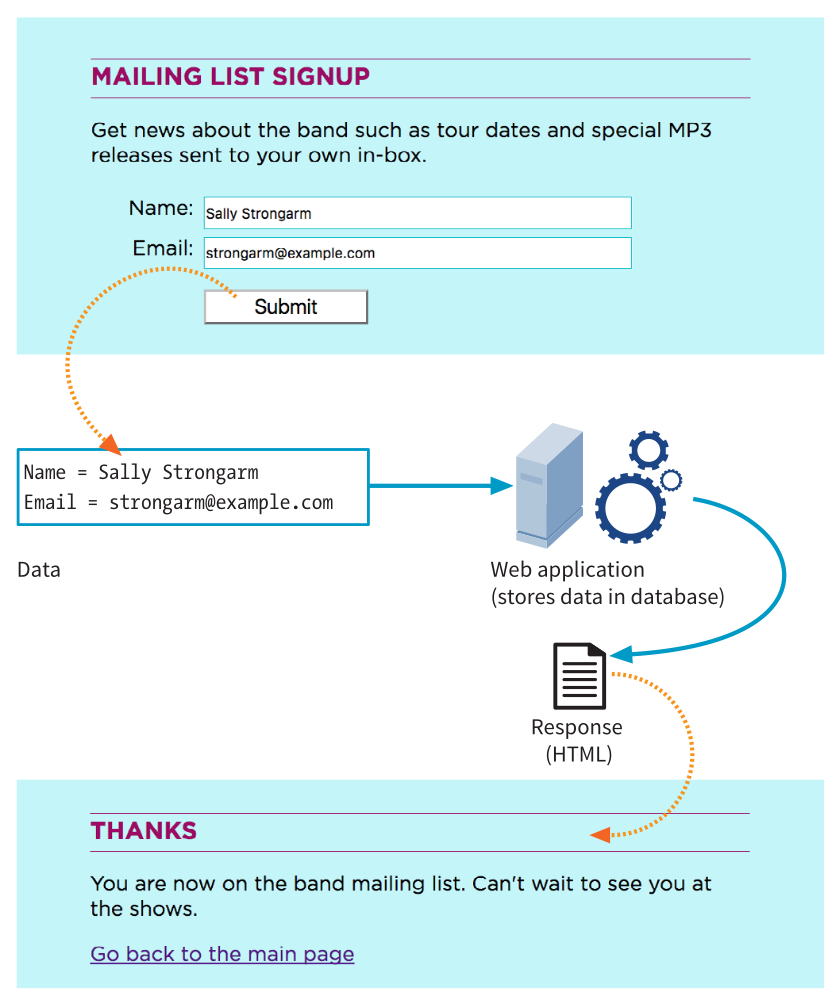

# Format në HMTL

Nuk zgjati shumë që te arrinim të shndërronim një rrjet faqesh për t’u lexuar në një mjet ku mund të kryhen veprime të ndryshme si blerje online, rezervime biletash, nënshkrime peticionesh, kërkime në site, postime në rrjete sociale etj. **Formularët** ose **Format** (web forms) janë pjesa kryesore që mundëson këto ndërveprime.

Me HTML5 janë prezantuar shumë elemente dhe atribute të reja për formularët që i bëjnë më të lehtë për t’u përdorur si për vizitorët, ashtu edhe për zhvilluesit. Disa nga këto elemente dhe funksionalitete kanë nevojë ende për mbështetje të plotë nga browsers, por janë një hap i madh përpara.

Kapitulli mbi formularët mbulon:

- **Si funksionojnë formularët**: Kombinimi i elementeve HTML në faqe me skripte apo aplikacione që funksionojnë në server.
- **Krijimi i formularëve**: Me elemente si fushat e inputit, butonat dhe menutë dropdown.
- **Rëndësia e dizajnit të formularëve**: Për të përmirësuar eksperiencën e përdoruesit.

## Si funksionojnë formularët?

Një formular ka dy komponentë kryesore:

1. **Formulari në faqe**: Elementet vizuale të krijuara me HTML, si fusha për të futur tekst, butona dhe menutë dropdown, që përdoren për të mbledhur të dhëna nga përdoruesi.
2. **Aplikacioni apo skripti në server**: Ky merr të dhënat e mbledhura, i përpunon dhe jep një përgjigje. Pa këtë komponent, formulari nuk mund të funksionojë si duhet.

### Procesi nga futja e të dhënave deri te përgjigjja

1. Një vizitor, le ta quajmë Arben, hap një faqe me një formular. Browser-i e përpunon HTML-në dhe shfaq kontrollat e formularit (p.sh., fusha teksti dhe butoni Submit).
2. Arbeni fut emrin dhe email-in e saj dhe shtyp butonin **Submit**.
3. Browser-i mbledh informacionin, e kodon dhe e dërgon në server.
4. Serveri përpunon informacionin (p.sh., ruan të dhënat në një bazë të dhënash për një listë dërgimi).
5. Serveri kthen një përgjigje, që mund të jetë një faqe falënderimi, një mesazh gabimi, ose një faqe tjetër e ngjashme.
6. Kjo përgjigje shfaqet në browser-in e Arbenit.



---

### Pse janë të rëndësishëm formularët?

Formulari më i njohur online është ndoshta kutia e kërkimit në faqen kryesore të Google. Përveç kërkimeve, formularët përdoren për:

- Regjistrim në faqe
- Blenja online
- Abonim në buletine

---

### Llojet e kontrolleve të formularëve

1. **Tipi text**:
   - **`text`**: Përdoret për fusha si email apo emra.
   - **`password`**: Si tekst, por fsheh karakteret e shkruara.
   - **`textarea`**: Për mesazhe apo komente më të gjata.

2. **Zgjedhja midis opsioneve**:
   - **`radiobutton`**: Zgjedh një opsion nga disa.
   - **`checkbox`**: Zgjidh një ose më shumë opsione.
   - **`dropdown`**: Përzgjedh një opsion nga një listë.

3. **Dërgimi i formularit**:
   - **Butoni `submit`**: Dërgon të dhënat te serveri.
   - **Buton imazhi**: Një version grafik i butonit Submit.
   - **Ngarkimi i skedarëve**: Lejon përdoruesit të ngarkojnë skedarë (si imazhe).

---

### Çiftet emër/vlerë (name/value pairs)

Browser-i i dërgon të dhënat e mbledhura te serveri si çifte emër/vlerë:

- **Emri (name)**: Identifikon elementin e formularit (p.sh., "username").
- **Vlera (value)**: Të dhënat e futura nga përdoruesi ose një opsion i përzgjedhur.

P.sh., për një formular që kërkon emrin dhe muzikantin e preferuar:

```html
username=Ivy
vote=Herbie
```

---

Në vijim do të mësoni:

- Si të krijoni formularët tuaj.
- Si të përdorni kontrollet dhe tipet e reja të HTML5 për formularë.

## Elementi `<form>` dhe atributet e tij

### Elementi `<form>`

Elementi `<form>` përdoret për të shtuar formularë në një faqe interneti dhe vepron si një **konteiner** që përmban të gjitha kontrollat e formularit si fushat e inputit, butonat dhe elemente të tjera. Ai gjithashtu mund të përmbajë elemente të tjerë si tituj (`<h1>`, `<p>`, lista etj.), por **nuk mund të përmbajë një tjetër element `<form>` brenda tij**.

[Shembulli 1](./form1.html) i një formulari të thjeshtë për regjistrimin në një listë dërgimi:

```html
<!DOCTYPE html>
<html>
<head>
    <title>Regjistrohu në listën tonë të emailit</title>
    <meta charset="utf-8">
</head>
<body>
    <h1>Regjistrim në listën e emailit</h1>
    <form action="/mailinglist.php" method="POST">
        <fieldset>
            <legend>Bashkohuni me ne</legend>
            <p>Merrni lajme mbi ngjarjet dhe ofertat speciale direkt në kutinë tuaj postare.</p>
            <ol>
                <li>
                    <label for="firstlast">Emri:</label>
                    <input type="text" name="fullname" id="firstlast">
                </li>
                <li>
                    <label for="email">Email:</label>
                    <input type="text" name="email" id="email">
                </li>
            </ol>
            <input type="submit" value="Dërgo">
        </fieldset>
    </form>
</body>
</html>
```

---

#### Atributet kryesore të elementit `<form>`

1. **Atributi `action`**
   - Tregon URL-në e aplikacionit ose skriptit që do të përpunojë të dhënat e formularit.
   - Shembull:  

     ```html
     <form action="/mailinglist.php" method="POST">
     ```

   - Në këtë rast, të dhënat do t’i dërgohen skriptit **mailinglist.php**, që ndodhet në server.
   - Teknologjitë e zakonshme për përpunimin e formularëve përfshijnë:
     - **PHP**: Më e përdorura për përpunimin e formularëve.
     - **ASP** dhe **ASP.NET**: Teknologji të Microsoft-it.
     - **Ruby on Rails**, **Python**, dhe **JavaServer Pages (JSP)**.

2. **Atributi `method`**
   - Tregon mënyrën se si të dhënat do t’i dërgohen serverit.
   - Vlerat e mundshme janë:
     - **POST**: Dërgon të dhënat si një kërkesë të veçantë HTTP. Përdoret për:
       - Formularë të gjatë.
       - Informacion sensitiv (fjalëkalime, adresa).
       - Modifikime në një bazë të dhënash.
     - **GET**: Të dhënat shtohen në URL pas një simboli `?`. Përdoret për:
       - Formularë të shkurtër (p.sh., kuti kërkimi).
       - Situata kur të dhënat duhet të jenë të dukshme ose të ruhen si një lidhje.

   - Shembull:  

     ```html
     <form action="/mailinglist.php" method="POST">
     ```

     Kjo përdor **POST** për të dërguar informacionin.

---

#### Metodat `GET` dhe `POST` - Krahasimi

| **GET**                        | **POST**                         |
|--------------------------------|----------------------------------|
| Të dhënat shfaqen në URL.      | Të dhënat dërgohen veçmas dhe janë të fshehura. |
| Përdoret për formularë të thjeshtë ose kërkime. | Përdoret për formularë të ndërlikuar dhe të dhëna sensitive. |
| Ka limit në numrin e karaktereve. | Nuk ka limit në të dhëna. |
| Mund të ruhet si lidhje.       | Nuk mund të ruhet si lidhje.     |

---

#### Struktura e një formulari

Një formular zakonisht ka këtë strukturë bazë:

```html
<form action="URL" method="GET ose POST">
    <!-- Kontrollat e formularit këtu -->
</form>
```

Elementet brenda një formulari përfshijnë:

- **Kontrollet e formularit**: Fusha teksti, butona, etj.
- **Atributet shtesë**: Si `id` për të identifikuar formularin.

---

#### Rekomandime për përdorimin e POST dhe GET

- Përdorni **GET** për kërkesa të thjeshta që nuk ndryshojnë të dhënat e serverit.
- Përdorni **POST** për dërgimin e të dhënave personale, të ndjeshme ose për modifikime në bazën e të dhënave.
- Sigurohuni që serveri të përdorë HTTPS për të mbrojtur të dhënat gjatë transmetimit.

## Variablat dhe Përmbajtjen në Formularët HTML

### Çfarë janë kontrollet e formularit?

Kontrollet e formularit janë elemente që përdoren për të mbledhur informacione nga përdoruesit. Këto përfshijnë:

- Fushat e tekstit.
- Butonat.
- Menutë rënëse (dropdowns).
- Kontrollet speciale (p.sh., kutitë për zgjedhje).

Për një dizajn intuitiv dhe praktik, është e rëndësishme që të kuptoni se si secili prej këtyre kontrolleve funksionon dhe si të përdoren ato në mënyrë efektive.

---

#### **Atributi `name`**

- Çdo kontroll i formularit duhet të ketë një atribut **`name`**, përveç butonave **submit** dhe **reset**.
- **Roli i atributit `name`**:  
  Atributi `name` përcakton **emrin e ndryshores** (variable) që do të përdoret nga aplikacioni i serverit për të përpunuar informacionin.

##### Shembull: Fusha e komenteve

```html
<textarea name="comment" rows="4" cols="45" placeholder="Shkruani komentin tuaj këtu."></textarea>
```

- Në këtë rast, komenti i përdoruesit do të ruhet si **ndryshorja `comment`**.  
  P.sh., nëse përdoruesi shkruan:  
  **“Kjo është banda më e mirë!”**, të dhënat do të dërgohen në server si:

  ```plaintext
  comment=Kjo+është+banda+më+e+mirë%21
  ```

##### Përdorimi i `name` në formularin tonë të mëparshëm

```html
<input type="text" name="fullname" id="firstlast">
<input type="text" name="email" id="email">
```

- Këtu kemi dy variabla:
  - **`fullname`**: Për emrin dhe mbiemrin e përdoruesit.
  - **`email`**: Për adresën e email-it të përdoruesit.

---

#### **Rregullat për emërtimin e variablave**

1. **Përputhshmëria me aplikacionin**  
   - Emrat e variablave duhet të përputhen me ato që aplikacioni ose skripti në server pret.  
   - P.sh., nëse një skript kërkon një ndryshore të quajtur `user_email`, atëherë duhet të përdorni pikërisht këtë emër në formularin tuaj.

2. **Emra të thjeshtë dhe përshkrues**  
   - Nëse aplikacioni nuk ekziston ende, zgjidhni emra të qartë dhe përshkrues, si:  
     - `user_name` për emrin e përdoruesit.  
     - `phone_number` për numrin e telefonit.

3. **Shmangni hapësirat në emra**  
   - Përdorni në vend të tyre **ndërthyerje** (`_`) ose **viza** (`-`):  
     P.sh., `first_name` ose `first-name`.

4. **Emra unikë**  
   - Sigurohuni që çdo variabël të ketë një emër unik për të shmangur konfuzionin gjatë përpunimit të të dhënave.

---

#### **Çfarë ndodh pas mbushjes së formularit?**

1. **Të dhënat mblidhen nga kontrolli i formularit.**  
   P.sh., përdoruesi shkruan:
   - Emër: **Arber Nika**  
   - Email: **<arber@example.com>**

2. **Formulari krijon çifte ndryshore/vlerë.**  
   Të dhënat përpunohet si:  

   ```plaintext
   fullname=Arber+Nika&email=arber%40example.com
   ```

3. **Të dhënat dërgohen në server.**  
   Serveri i merr këto informacione dhe i përdor sipas nevojës (ruajtje në bazën e të dhënave, dërgim mesazhi etj.).

## PËRMBLEDHJA E PLOTË E KONTROLLEVE TË FORMAVE

Kjo është pjesa argëtuese—eksperimentimi me kodin që shton kontrolle të formave në faqe. Në këtë seksion, do të prezantohen elementet që krijojnë:  

- **Fushat për futje të tekstit**  
- **Fushat e specializuara për futje të tekstit**  
- **Butonat për dërgim dhe rivendosje**  
- **Butonat radio dhe kutitë kontrolluese (checkbox)**  
- **Menutë rënëse dhe listat rrotulluese**  
- **Kontrollin për ngarkim të skedarëve**  
- **Kontrolle të fshehura**  
- **Data dhe orë**  
- **Kontrolle numerike**  
- **Kontroll për përzgjedhjen e ngjyrave**  

### Fushat për Futje Teksti  

#### Kontroll për Futje Teksti me Një Rresht  

Një nga përdorimet më të zakonshme të formave në ueb është futja e informacionit në tekst. Nëse kërkohet një rresht i vetëm teksti, përdorni elementin `<input>` me atributin `type` të vendosur në **"text"**.  

**Shembull:**  

```html
<li>
  <label>Ngjyra e preferuar: 
    <input type="text" name="ngjyra_preferuar" value="Kuqe" maxlength="50">
  </label>
</li>
```  

- **`name`:** Identifikon emrin e ndryshores që dërgohet në server.  
- **`value`:** Teksti i paracaktuar që shfaqet në fushë.  
- **`maxlength` dhe `minlength`:** Kufizon numrin maksimal ose minimal të karaktereve që mund të futen.  
- **`placeholder`:** Jep një sugjerim vizual për tekstin që duhet futur.  

#### Kontroll për Futje Teksti me Shumë Rreshta  

Nëse dëshironi që përdoruesit të futin më shumë se një rresht teksti, përdorni elementin `<textarea>`.  
**Shembull:**  

```html
<p>
  <label>Pse të pëlqen banda jonë?<br>
    <textarea name="arsye" rows="5" cols="50">Sepse janë fantastikë!</textarea>
  </label>
</p>
```  

- **`rows` dhe `cols`:** Përcaktojnë madhësinë e kutisë së tekstit në rreshta dhe kolonë.  
- **`placeholder`:** Jep një udhëzim se çfarë të futet në fushë pa qenë pjesë e të dhënave të dërguara.  

---

### Kontroll për Fushat e Specializuara  

#### Fusha për Fjalëkalim  

Përdorni atributin `type="password"` për të krijuar një fushë ku tekstet e futura fshihen me shenja të tilla si asterisk (*) ose pika (•).  
**Shembull:**  

```html
<li>
  <label>Fjalëkalimi: 
    <input type="password" name="fjalekalimi" maxlength="12">
  </label>
</li>
```  

⚠️ **Shënim:** Informacioni në këtë fushë nuk është i koduar automatikisht. Duhet të përdorni HTTPS për siguri.  

#### Fusha për Kërkim, Email, Numër Telefoni dhe URL  

Këto fusha të specializuara përmirësojnë përvojën e përdoruesit dhe ndihmojnë shfletuesit të ofrojnë funksione shtesë, si kontrollet e vlefshmërisë së të dhënave ose tastiera e përshtatur.  
**Shembuj:**  

```html
<input type="search" placeholder="Kërko">
<input type="email" placeholder="Adresa e email-it">
<input type="tel" placeholder="Numri i telefonit">
<input type="url" placeholder="Adresa e faqes së internetit">
```  

---

### Butonat e Formularit

#### Butoni i Dërgimit dhe Rivendosjes  

Butoni i dërgimit (`<input type="submit">`) përdoret për të dërguar të dhënat e formularit në server. Butoni i rivendosjes (`<input type="reset">`) kthen fushat e formularit në gjendjen e tyre fillestare.  

**Shembull:**  

```html
<p>
  <input type="submit" value="Dërgo"> 
  <input type="reset" value="Rivendos">
</p>
```

⚠️ **Shënim:** Në dizajnet moderne, butoni i rivendosjes përdoret më rrallë për shkak të kontrollit dinamik të të dhënave me JavaScript.  

### Butonat Radio dhe Checkbox në HTML

**Butonat radio** dhe **checkbox** përdoren shpesh për të ofruar mundësi zgjedhjeje për përdoruesit në formularët e uebit. Ato janë të ngjashme sepse funksionojnë si çelësa "on/off", por kanë përdorime të ndryshme në varësi të llojit të zgjedhjes që dëshironi të lejoni.

---

## Butonat Radio

**Radio buttons** janë të përshtatshme kur lejohet vetëm një zgjedhje nga një grup mundësish. Përdorimi i tyre imiton funksionalitetin e butonave të vjetër të radios: kur shtypet një buton, të tjerët "dalin jashtë".  

### **Sintaksa për butonat radio**

```html
<input type="radio">
```

Për të krijuar një grup butonash radio që lidhen mes tyre, duhet të përdorni atributin `name` me të njëjtën vlerë për të gjitha butonat e grupit.

**Shembull:** Zgjedhja e grupmoshës

```html
<p>Sa vjeç jeni?</p>
<ol>
  <li><input type="radio" name="age" value="under24" checked> Nën 24</li>
  <li><input type="radio" name="age" value="25-34"> 25 deri 34</li>
  <li><input type="radio" name="age" value="35-44"> 35 deri 44</li>
  <li><input type="radio" name="age" value="over45"> 45+</li>
</ol>
```

#### **Pikat kryesore**

- **`name`:** Lidh butonat radio në një grup të vetëm.
- **`value`:** Tregon vlerën që dërgohet në server kur një buton është zgjedhur.
- **`checked`:** Përcakton cilin buton radio do të jetë i zgjedhur kur faqja ngarkohet.

---

### **Checkbox**

**Checkbox** lejojnë përdoruesit të zgjedhin një ose më shumë opsione nga një grup. Ndryshe nga butonat radio, checkbox mund të zgjedhen në mënyrë të pavarur nga njëri-tjetri.

#### **Sintaksa për checkbox**

```html
<input type="checkbox">
```

**Shembull:** Preferencat muzikore

```html
<p>Çfarë lloj muzike dëgjoni?</p>
<ul>
  <li><input type="checkbox" name="genre" value="punk" checked> Punk rock</li>
  <li><input type="checkbox" name="genre" value="indie" checked> Indie rock</li>
  <li><input type="checkbox" name="genre" value="hiphop"> Hip Hop</li>
  <li><input type="checkbox" name="genre" value="rockabilly"> Rockabilly</li>
</ul>
```

### **Pikat kryesore:**

- **`name`:** Grupimi i disa kutive të zgjedhjes me të njëjtin emër.
- **`value`:** Tregon vlerën që dërgohet në server për çdo opsion të zgjedhur.
- **`checked`:** Përcakton kutitë që janë të zgjedhura kur faqja ngarkohet.

**Shembull tjetër:** Një checkbox i vetëm për të pranuar promovimet me email:

```html
<p><input type="checkbox" name="OptIn" value="yes"> Po, dërgomë njoftime dhe promovime speciale me email.</p>
```

---

### **Dallimet midis Radio dhe Checkbox**

| **Karakteristika**       | **Radio Button**                       | **Checkbox**                              |
|--------------------------|----------------------------------------|-------------------------------------------|
| **Numri i zgjedhjeve**   | Vetëm një zgjedhje për grup            | Një ose më shumë zgjedhje për grup        |
| **Sjellja**              | Kur një buton zgjidhet, të tjerët fiken | Mund të zgjidhen dhe ç'zgjidhen pavarësisht |
| **Përdorimi tipik**      | Pyetje ku zgjedhja është ekskluzive    | Pyetje me zgjedhje të shumëfishta         |

Nëse përdoruesi duhet të zgjedhë vetëm një opsion, përdorni **butona radio**. Nëse janë të nevojshme zgjedhje të shumëfishta, përdorni **checkbox**.
